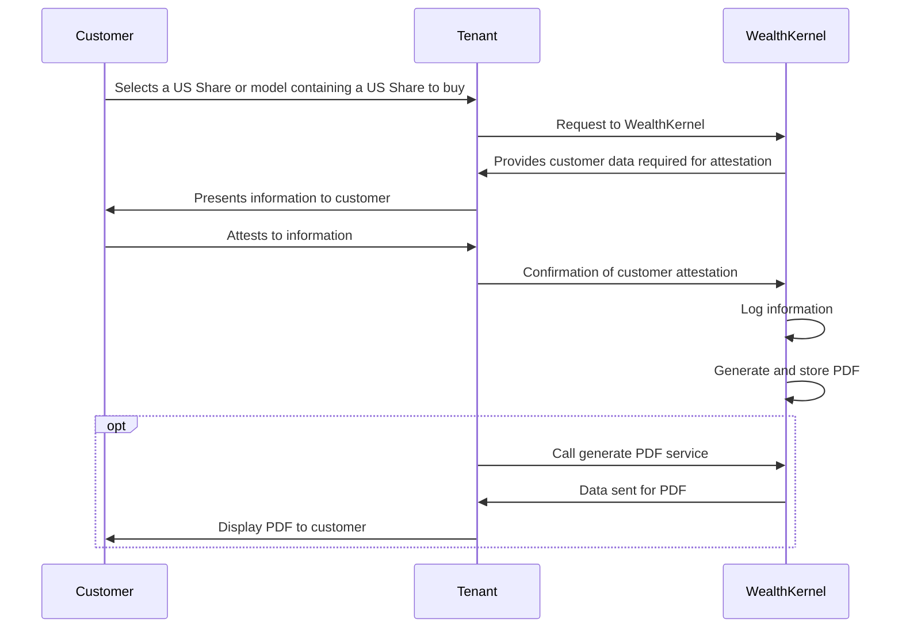

# US Withholding Tax

When a non-US resident invests in US shares, the US government mandates a tax charge on any income received from those shares. The tax charge will be dependent on the tax residency of the customer making the investment. 

To ensure the customer pays the correct amount of tax, they can complete a W-8 BEN form. 

The W-8 BEN form is a declaration by the customer and includes information such as their personal details and tax residency. The form remains active until the end of the third calendar year in which the form is signed (i.e. if the form is signed in September 2022, it is valid until 31st December 2025). At this point a customer will need to complete a new form to benefit from reduced rates of withholding tax.

