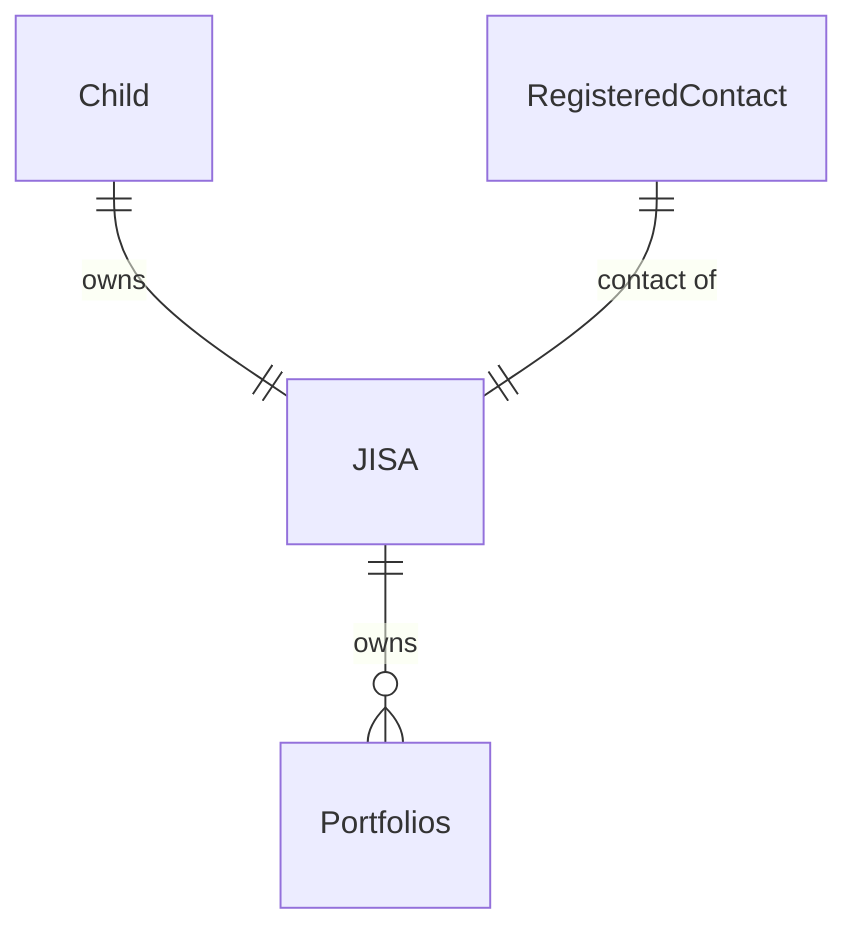
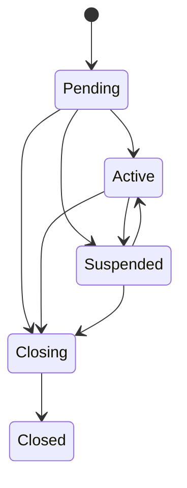

# Account Basics

Accounts are an entity which hold information about the type product a client may wish to open and validate that [all the requirements](Opening-Requirements.md) are met to be able to open that account.

Each account can have multiple parties and also have multiple Portfolios.

For example, here are the links that a JISA would have

Put simply, a JISA is owned by a child and has a registered contact associated with it. It can have one or more portfolios attached to it.

## Account types

There are currently four types of accounts supported

- GIA
- ISA
- JISA
- SIPP

Each of these will have their own requirements for opening, which will be checked upon creation of the account.

<!-- theme: warning -->
> SIPPs are currently in a private beta. If you wish to access them, please contact your account manager for more details

## Account Lifecycle

| Status | Explanation |
|---|---|
| Pending | A very short lived state, before the account has checked whether all the relevant checks for parties have passed, such as KYC. |
| Active | All checks have passed and the account is available to be used. |
| Suspended | One or more checks on the parties have failed and the account is suspended. Once checks have been fixed the account will move back to `Active`. |
| Closing | Account is in the process of closing but is not closed yet. This may be because there are still holdings currently in the process of selling down. |
| Closed | Account is closed. This is the terminal state for an account. |

## Accounts Webhooks

You can opt to receive accounts webhooks which will give you updates about accounts' current status. You can find out more about using webhooks on our [webhooks guide](../webhooks/Getting-Started.md), or look at our main API documentation to see the structure of each of the accounts webhooks.

Currently, the following webhooks are available:

| Event Type | Description |
|------------|------------:|
| `accounts.account_created` | Notification that a new account has been created. The account will be in the `Pending` status. |
| `accounts.account_activated` | The account has passed all checks (KYC) and is now available for use. The account will be in the `Active` status. |
| `accounts.account_suspended` | One or more checks on the parties have failed and the account is suspended. The account will be in the `Suspended` status. |
| `accounts.account_unsuspended` | Previously failed checks have now passed and the account's activity can now be resumed. The account status will revert to the previous status before it was suspended. |
| `accounts.account_closing` | Account is in the process of closing but is not closed yet. The account will be in the `Closing` status. |
| `accounts.account_closed` | Account is closed. This is the terminal state for an account. The account will be in the `Closed` status. |
| `accounts.account_closure_cancelled` | Occurs when the account was `Closing`, but the account's closure has been cancelled. The account status will revert to the previous status before it started closing. |

### Account Lifecycle Webhooks Examples

**1. Account receives updated checks**

| What happened | Updated account status | Webhook event |
| ------------- | ---------------------- | ------------- |
| Account was created | `Pending` | `accounts.account_created` |
| Account passes all checks | `Active` | `accounts.account_activated` |
| Updated check is received | `Suspended` | `accounts.account_suspended` |
| After investigation, check is cleared | `Active` | `accounts.account_unsuspended` |

**2. Account is closed**

| What happened | Updated account status | Webhook event |
| ------------- | ---------------------- | ------------- |
| Account was created | `Pending` | `accounts.account_created` |
| Account passes all checks | `Active` | `accounts.account_activated` |
| Account starts closing process | `Closing` | `accounts.account_closing` |
| Assets are sold down, account is empty and finishes closure | `Closed` | `accounts.account_closed` |

**3. Account closure is cancelled**

| What happened | Updated account status | Webhook event |
| ------------- | ---------------------- | ------------- |
| Account was created | `Pending` | `accounts.account_created` |
| Account passes all checks | `Active` | `accounts.account_activated` |
| Account starts closing process | `Closing` | `accounts.account_closing` |
| Before closure process is completed, client decides they do not wish to close, closure is cancelled | `Active` | `accounts.account_closure_cancelled` |