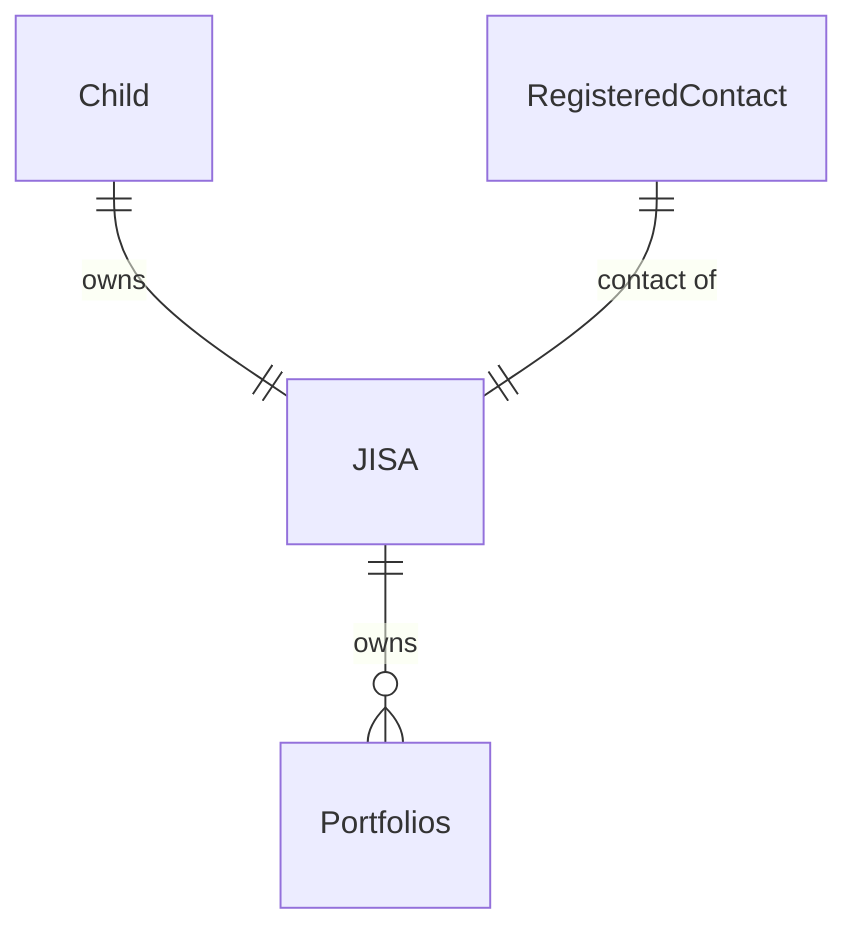
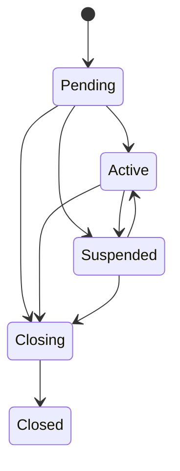

# Account Basics

Accounts are an entity which hold information about the type product a client may wish to open and validate that [all the requirements](Opening-Requirements.md) are met to be able to open that account.

Each account can have multiple parties and also have multiple Portfolios.

For example, here are the links that a JISA would have

Put simply, a JISA is owned by a child and has a registered contact associated with it. It can have one or more portfolios attached to it.

## Account types

There are currently four types of accounts supported

- GIA
- ISA
- JISA
- SIPP

Each of these will have their own requirements for opening, which will be checked upon creation of the account.

<!-- theme: warning -->
> SIPPs are currently in a private beta. If you wish to access them, please contact your account manager for more details

## Account Lifecycle

| Status | Explanation |
|---|---|
| Pending | A very short lived state, before the account has checked whether all the relevant checks for parties have passed, such as KYC. |
| Active | All checks have passed and the account is available to be used. |
| Suspended | One or more checks on the parties have failed and the account is suspended. Once checks have been fixed the account will move back to `Active`. |
| Closing | Account is in the process of closing but is not closed yet. This may be because there are still holdings currently in the process of selling down. |
| Closed | Account is closed. This is the terminal state for an account. |
