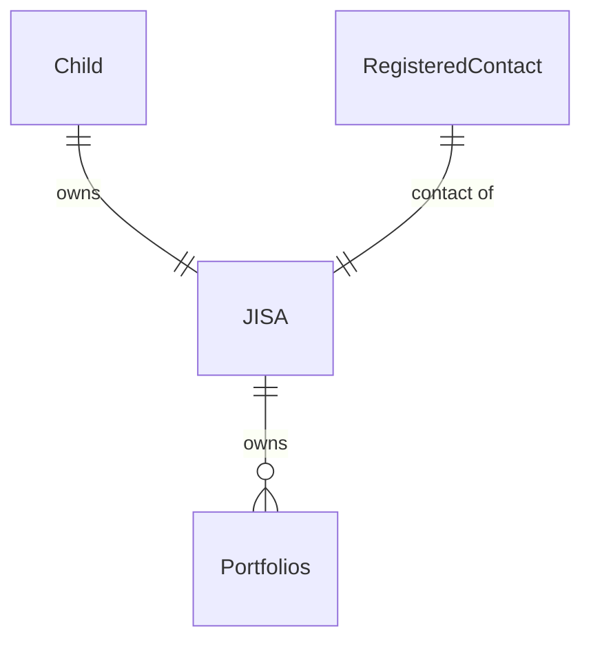
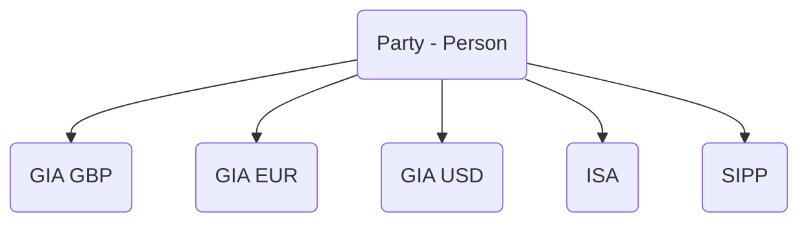
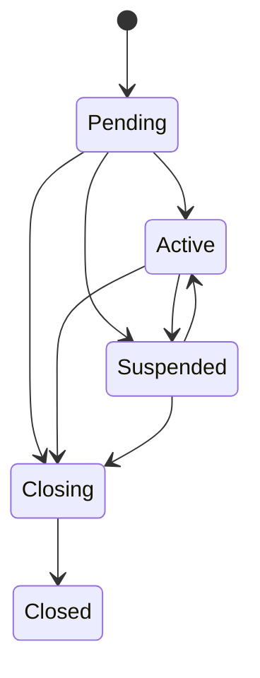

# Account basics

Accounts are an entity which hold information about the type of product a client may wish to open and validate that [all the requirements](Opening-Requirements.md) are met to be able to open that account.

Accounts may be linked to multiple parties and may also have multiple Portfolios. For example, here are the links that a JISA would have:

Put simply, a JISA is owned by a child and has a registered contact associated with it. It can have one or more portfolios attached to it.

## Account types

There are currently four types of accounts supported

- GIA
- ISA
- JISA
- SIPP

Each of these will have their own requirements for opening, which will be checked upon creation of the account.

## Account currencies

Account currency should be set for all account types, however we will default the account to GBP if it is not provided. The account currencies currently supported are GBP, EUR and USD. This applies to GIAs only. GBP is the only currency allowed for other account types. 

Once the currency of an account has been set, it cannot be changed. Any [Portfolios](docs/guides/adc4b06b3d4ed-portfolio-basics) created under an account will be opened in the same currency as the account itself. 

An example account structure for a party could be set up as follows:

## Account lifecycle

Once an account has been added, it has a lifecycle starting from `Pending` (meaning the account can't be funded yet) to `Closed` (meaning the account has been fully withdrawn and will no longer be funded).

| Status | Explanation |
|---|---|
| Pending | A short-lived state where the account isn't ready for funding, as additional checks (such as KYC) need to have passed for the associated parties. |
| Active | All checks have passed and the account is available to be used. |
| Suspended | One or more checks on the parties have failed and the account is suspended. Once checks have been fixed the account will move back to `Active`. |
| Closing | Account is in the process of closing but is not closed yet. This may be because there are still holdings currently in the process of selling down. |
| Closed | Account is closed. This is the terminal state for an account. |

## Opening accounts and due diligence

As mentioned previously, accounts will briefly wait in the `Pending` state until it is confirmed whether all checks have completed. Typically, this is a very short wait while our automated checks finish; these checks ensure we meet our legal requirements to perform due diligence on parties using our platform. It is expected that an account could stay in `Pending` for a little while, and so it should be clear to the user that the account isn't ready for investment. Additional accounts created for parties where all checks have been completed will move from `Pending` to `Active` immediately.  

In rare cases, we may need additional information about the party to complete our due diligence. The account status will remain in a `Pending` state until the additional information has been provided. To receive the most up-to-date information about an account's status, we recommend using the account webhooks which are detailed below.

## Accounts webhooks

You can opt to receive accounts webhooks which will give you updates about accounts' current status. You can find out more about using webhooks on our [webhooks guide](../webhooks/Getting-Started.md), or look at our main API documentation to see the structure of each of the accounts webhooks.

Currently, the following webhooks are available:

| Event Type | Description |
|------------|------------:|
| `accounts.account_created` | Notification that a new account has been created. The account will be in the `Pending` status. |
| `accounts.account_activated` | The party has passed all checks and their account is now available for use. The account will be in the `Active` status.
| `accounts.account_suspended` | One or more checks on the parties have failed and the account is suspended. The account will be in the `Suspended` status. |
| `accounts.account_unsuspended` | Previously failed checks have now passed and the account's activity can now be resumed. The account status will revert to the previous status before it was suspended. |
| `accounts.account_closing` | Account is in the process of closing but is not closed yet. The account will be in the `Closing` status. |
| `accounts.account_closed` | Account is closed. This is the terminal state for an account. The account will be in the `Closed` status. |
| `accounts.account_closure_cancelled` | Occurs when the account was `Closing`, but the account's closure has been cancelled. The account status will revert to the previous status before it started closing. |

### Account lifecycle webhooks examples

**1. Account receives updated checks**

| What happened | Updated account status | Webhook event |
| ------------- | ---------------------- | ------------- |
| Account was created | `Pending` | `accounts.account_created` |
| Account passes all checks | `Active` | `accounts.account_activated` |
| Updated check is received | `Suspended` | `accounts.account_suspended` |
| After investigation, check is cleared | `Active` | `accounts.account_unsuspended` |

**2. Account is closed**

| What happened | Updated account status | Webhook event |
| ------------- | ---------------------- | ------------- |
| Account was created | `Pending` | `accounts.account_created` |
| Account passes all checks | `Active` | `accounts.account_activated` |
| Account starts closing process | `Closing` | `accounts.account_closing` |
| Assets are sold down, account is empty and finishes closure | `Closed` | `accounts.account_closed` |

**3. Account closure is cancelled**

| What happened | Updated account status | Webhook event |
| ------------- | ---------------------- | ------------- |
| Account was created | `Pending` | `accounts.account_created` |
| Account passes all checks | `Active` | `accounts.account_activated` |
| Account starts closing process | `Closing` | `accounts.account_closing` |
| Before closure process is completed, closure is cancelled as it was accidental | `Active` | `accounts.account_closure_cancelled` |
