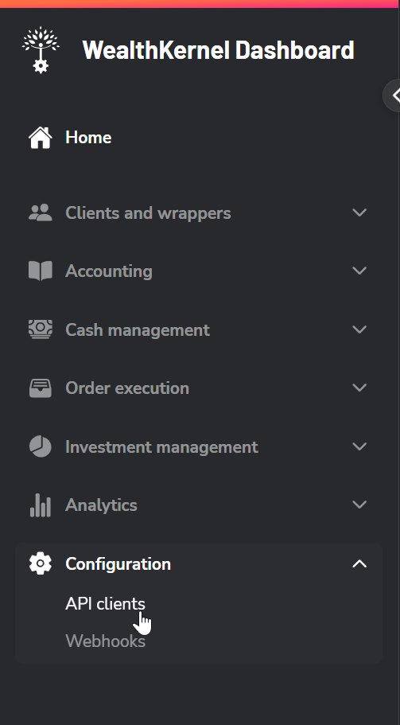
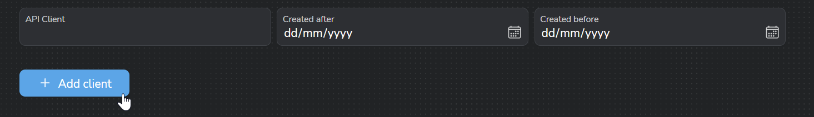
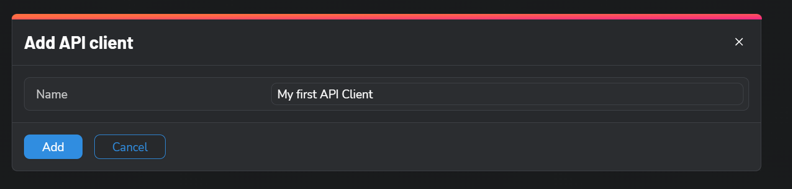
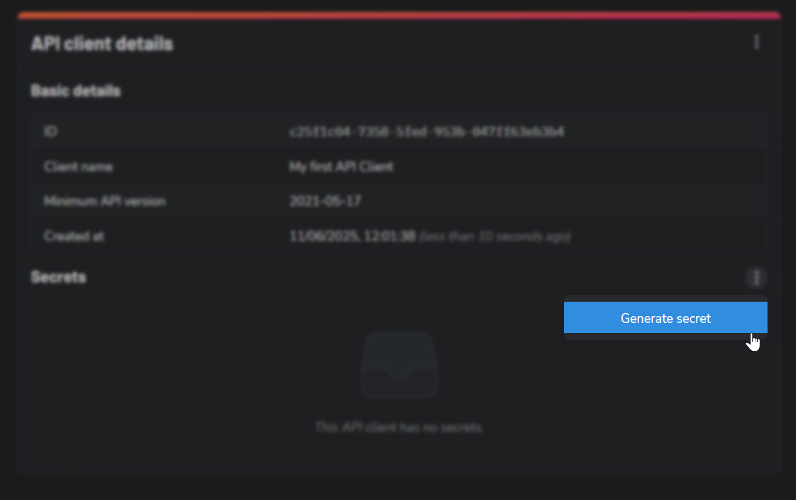
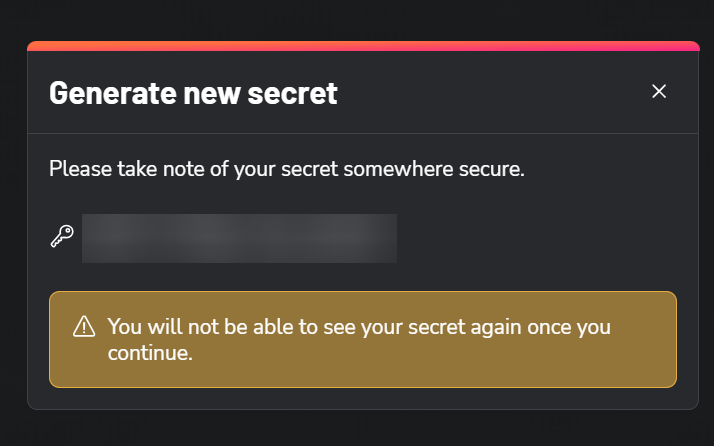

# Managing secrets

If you are a Dashboard admin user, you have permission to manage API clients and secrets for authenticating against the WealthKernel API.

API secrets are used as part of our authentication method. Documentation for this can be found <a href="/docs/api/docs/help/Authentication.md">here</a>.

<!-- theme: info -->

> #### Becoming an admin user
>
> If you do not have an admin user for your organisation, please contact your account manager who will be able to set this up for you.

## Generating a secret

1. Log in to the dashboard and go to Configuration -> API clients.

2. Select your API client. If you do not have one yet, click "Add API client". If you already have an API client, skip to step 4.

3. Type in a name for the API client and click "Add".

4. Click on the three-dot menu and select "Generate secret".

5. Your secret will be generated and displayed. Store this secret somewhere secure, as recommended in the prompt.

