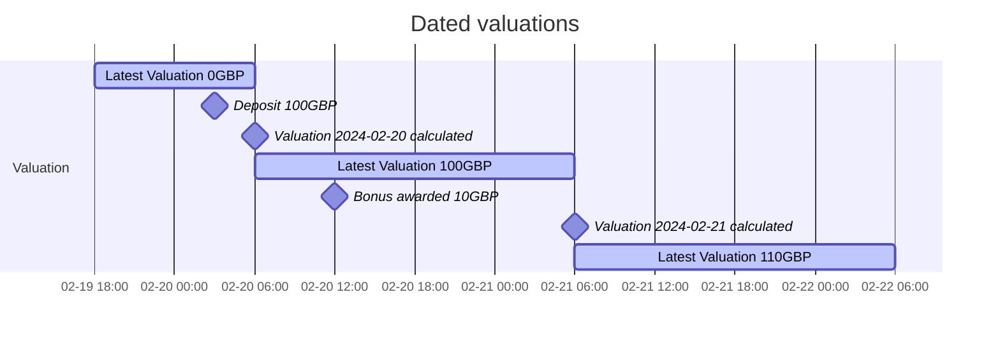
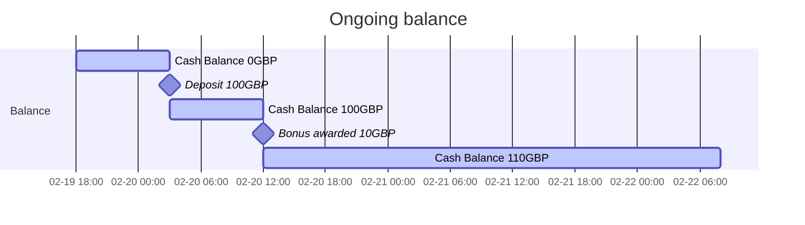

# Balance FAQs

## How does balances differ from valuations?

Valuations provide a history of the value of a portfolio whereas balances provides an indicative value of a portfolio currently, based on the previous day's closing prices for securities and FX rates.

Valuations are created at approximately the same time every day, for the previous day. Transactions booked with a date of t are only reflected in the valuation for t+1.

The balance is not dated, and is continuously updated, and will therefore reflect any actions taken on the portfolio, such as deposits, orders, or bonuses, as they happen.

### Example

<!-- theme: info -->
> Valuations can be recalculated when transactions are booked to a portfolio which already has a valuation for the date of the transaction - 1.

The cash balance is continuously updated so also the deposit immediately. The bonus behaves the same way, so the balance is updated immediately, making the full amount available for withdrawal or trading.

## Why are cash and holdings balances not returned with total balance?

This is to avoid large responses from portfolios that hold many positions.

## Why is the value/price/rate `null` in a portfolio's balance?

In rare circumstances we maybe unable to retrieve a latest price of a security or FX rate of a currency. In which case we will be unable to calculate the current value of the holding balance or cash balance, and therefore unable to calculate the value of the portfolio.
