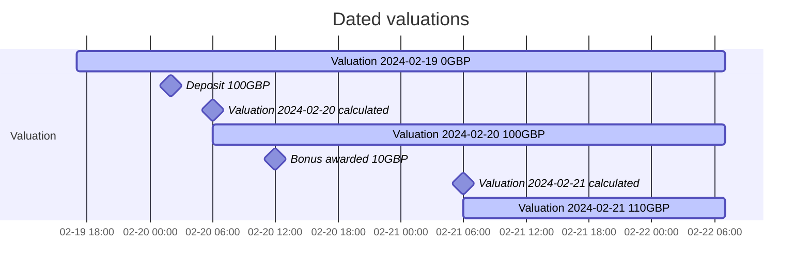
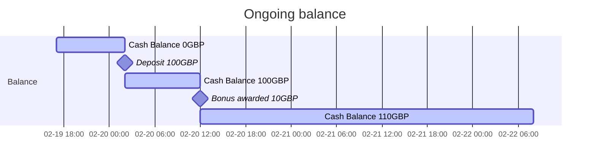

# Balance FAQs

## How does balances differ from valuations?

Valuations provide a history of the value of a portfolio whereas balances provides an indicative value of a portfolio currently, based on the previous day's closing prices for securities and FX rates.

Valuations are dated, and only transactions with a timestamp on or before a valuation's date will be reflected in the valuation.

Balances are not dated and are continuously updated; therefore, they will reflect any transactions booked to the portfolio as they occur.

### Example

<!-- theme: info -->
> Valuations will be recalculated when transactions are booked to a portfolio which already has a valuation for the date of the transaction - 1.

The cash balance is continuously updated so shows the deposit immediately. The bonus behaves the same way, so the balance is updated immediately, making the full amount available for withdrawal or trading.

## Why are cash and holdings balances not returned with total balance?

This is to avoid large responses from portfolios that hold many positions.

## Why is the value/price/rate `null` in a portfolio's balance?

In rare circumstances we maybe unable to retrieve a latest price of a security or FX rate of a currency. In which case we will be unable to calculate the current value of the holding balance or cash balance, and therefore unable to calculate the value of the portfolio.
