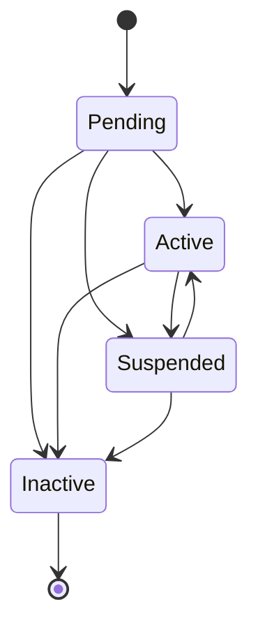

# Bank account basics

Bank accounts are a resource in our systems which hold information about a party's external bank accounts. These bank accounts can be used to fund their portfolios so that they may invest, and then later withdraw their cash.

Bank accounts are linked to one party, and can be used to fund any of the portfolios that the party has a relationship with. For example, an active bank account attached to a party with an active GIA can fund their GIA with the bank account.

# Bank account lifecycle

A bank account is first added into the system in a `Pending` state (where it can't yet be used for funding) and in most cases will quickly move into the `Active` state. It can then be used for funding until it reaches its terminal state `Inactive` where it can no longer be used for funding.

Below you can see a state diagram with possible state transitions, followed by a table to explain what is meant by each state.

| Status | Explanation |
|---|---|
| Pending | A short-lived state where the bank account can't yet be used for funding, as checks are being performed on the bank account. |
| Active | The bank account is ready to be used for funding. |
| Suspended | One or more checks on the bank account have failed and the bank account is suspended. Once checks have been fixed the account will move back to `Active`. |
| Inactive | The bank account is no longer active and cannot be used for funding. To use the bank account again, it will need to be added as a new bank account. |

# Bank account validation

Bank accounts with a sort code and account number pass through a modulus check. This algorithm verifies whether the combination of sort code and account number is legitimate. The check allows us to minimise errors but does not validate that the bank account details exist; an additional check is performed for that purpose, as described in the section below.

For more information on modulus checking, visit [Vocalink's website](https://www.vocalink.com/tools/modulus-checking/).

## International bank accounts

Bank accounts with BIC and IBAN go through some checks. These checks will validate the IBAN checksum, the IBAN structure, and the account number checksum (on the BBAN). The last two checks will vary, depending on the bank account's country.

For more information on IBAN verification, visit the [IBAN checker](https://www.iban.com/iban-checker) and [IBAN structure examples](https://www.iban.com/structure)

# Bank account checks

WealthKernel perform checks on bank accounts to make sure that the bank account details provided match the party name. It is important that the correct party name and bank details are provided, otherwise these checks are likely to fail and require manual intervention.

In the rare cases where we cannot automatically verify a bank account belongs to the party, we may need additional information to prove that the bank account belongs to them. The bank account status will remain in a `Pending` state until the additional information has been provided and verification has been successful. To receive the most up-to-date information about a bank account's status, we recommend using the bank account webhooks which are detailed below.

<!-- theme: info -->
> Note that we cannot perform automatic checks for international bank accounts with BIC and IBAN. Our compliance team will manually check international bank accounts upon request with valid documentation. Please contact your tenant manager for more information.

# Bank account webhooks

You can opt in to receive bank accounts webhooks which will give you updates about bank accounts' current status. You can find out more about using webhooks on our [webhooks guide](../webhooks/Getting-Started.md), or look at our main API documentation to see the structure of each of the bank accounts webhooks.

Currently, the following webhooks are available:

| Event Type | Description |
|------------|------------:|
| `bank_accounts.bank_account_activated` | The bank account has passed checks and can be used for funding. The bank account will be in the `Active` state. |
| `bank_accounts.bank_account_suspended` | One or more checks on the bank account have failed and the bank account is suspended. We will not accept funding, and the bank account will be in the `Suspended` status. |
| `bank_accounts.bank_account_deactivated` | The bank account has been deactivated and can no longer be used for funding. The bank account will be in the `Inactive` state. |