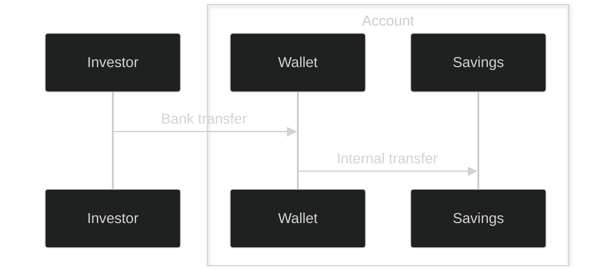

# Cash savings basics

## Prerequisites

- An active Party with an active Bank Account.

## Overview

## Process for depositing
1. Create an account for the investor's wallet and portfolio.
2. Create wallet portfolio to receive cash into.
3. Create a savings portfolio to earn interest from.
4. Deposit cash into your wallet by creating a deposit expectation and instructing investor to make the bank transfer to WealthKernel Clients account. More information can be found in [our deposit guide](docs/guides/100c7af36190b-deposit-basics). A webhook event will be sent when the deposit has been matched.
5. Request internal transfer of cash into savings portfolio.

## Process for withdrawing

1. Request internal transfer of cash from savings portfolio into wallet portfolio
2. Create withdrawal from wallet portfolio. More information can be found in [our withdrawals guide](/docs/guides/8i75b7xiegufv-withdrawals-basics)
3. Payment will be made to investor bank account

> **Note:** Internal cash transfers involving savings portfolios are not instant.