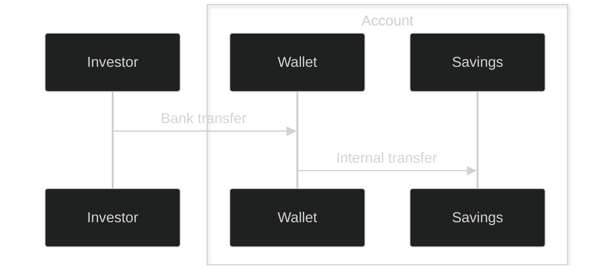

# Deposit into a cash savings portfolios

## Prerequisites

- An active Party with an active Bank Account.

## Overview

## Process 
1. Create an account for the investor's wallet and portfolio.
2. Create wallet portfolio to receive cash into.
3. Create a savings portfolio to earn interest from.
4. Deposit cash into your wallet by creating a deposit expectation and instructing investor to make the bank transfer to WealthKernel Clients account. More information can be found in our guides at https://docs.wealthkernel.com/docs/guides/100c7af36190b-deposit-basics. A webhook event will be sent when the deposit has been matched.
5. Transfer cash into savings portfolio.

> **Note:** Internal cash transfers involving savings portfolios are not instant.

