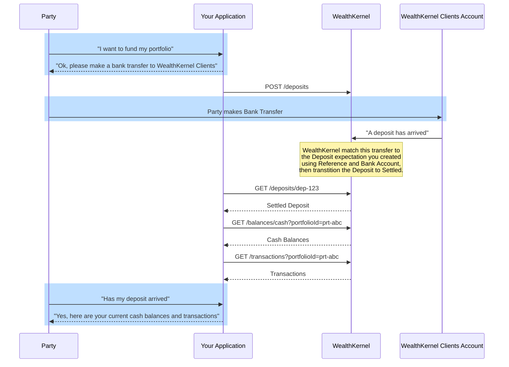

# Deposit Basics

A deposit represents an expectation that the counter party of a portfolio will be depositing funds originating from a specified bank account.

## Funding a Portfolio

The process of funding a portfolio involves multiple steps:

1. Construct a Deposit Definition.
    - `portfolioId` is the identifier of the destination portfolio.
    - `useDefaultBankAccount` when set to `true` then it will be assumed the deposit will be coming from the parties nominated bank account.
    - `bankAccountId` is the identifier of the bank account the deposit will be coming from. Must be used when `useDefaultBankAccount` is set to `false` and the account must belong to the party.
    - `consideration` is the expected amount of the deposit.
    - `reference` is the expected reference that will accompany the deposit. Please see the [FAQs](docs/deposits/FAQs.md) for guidance on values to use.
2. `POST` the definition to `/deposits`.
3. Instruct the counter party to make a bank transfer for the amount the intend to deposit with the accompanying reference to WealthKernel Clients account.
4. WealthKernel receive notification of the deposit and try to match to the previously created deposit based on source account details and reference.
5. Once matched the deposit will move to a status of `Settled`, a transaction will be booked against the destination portfolio which will be reflected in the balance.

