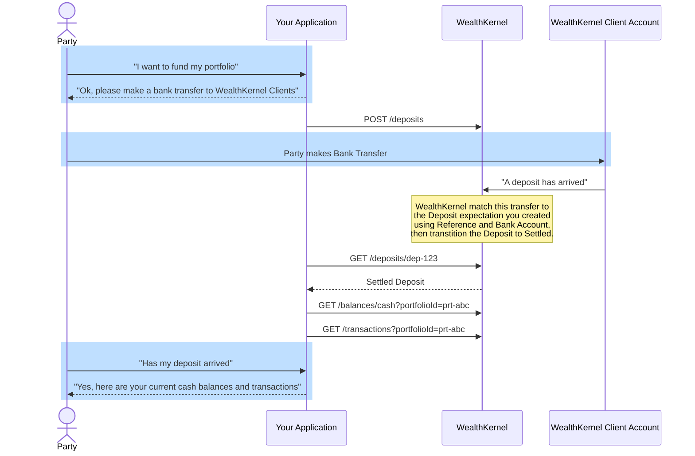

# Deposit Basics

Deposits represent an expectation that the counter party of a portfolio will be depositing funds originating from a specified bank account.

## Funding a Portfolio

```mermaid
sequenceDiagram
actor Party

participant Your Application

participant WealthKernel
participant WealthKernel Client Account

rect rgb(191, 223, 255)
Party ->> Your Application: "I want to fund my portfolio"
Your Application -->> Party: "Ok, please make a bank transfer to WealthKernel Clients"
end

Your Application ->> WealthKernel: POST /deposits

rect rgb(191, 223, 255)
Party ->> WealthKernel Client Account: Party makes Bank Transfer
end

WealthKernel Client Account ->> WealthKernel: "A deposit has arrived"
Note over WealthKernel: WealthKernel match this transfer to<br>the Deposit expectation you created<br>using Reference and Bank Account,<br> then transtition the Deposit to Settled.

Your Application ->> WealthKernel: GET /deposits/dep-123
WealthKernel -->> Your Application: Settled Deposit

Your Application ->> WealthKernel: GET /balances/cash?portfolioId=prt-abc
Your Application ->> WealthKernel: GET /transactions?portfolioId=prt-abc

rect rgb(191, 223, 255)
Party ->> Your Application: "Has my deposit arrived"
Your Application -->> Party: "Yes, here are your current cash balances and transactions"
end
```
