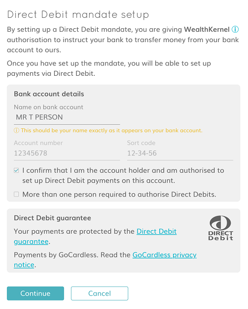
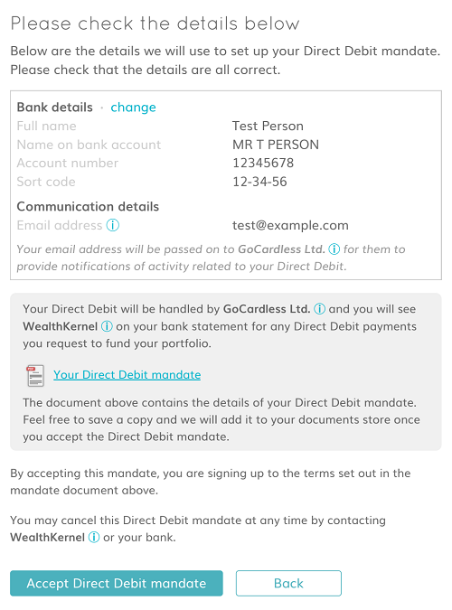
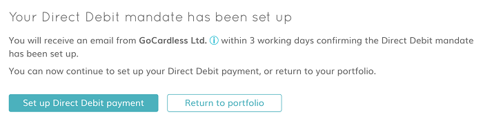

# UI guidelines & approval

The content of your customer facing screens for setting up a Direct Debit mandate must be approved as "Payment Services Regulations" compliant. This regulation covers the set up of the mandate.

Please note the designs for the UI of screens relating to Direct Debit payments do not need approval.

We would ask that you follow these guidelines as closely as possible. This will help avoid delay in gaining approval and also to prevent problems arising when regulators force change.

## Page 1 - Bank account capture

The first page must capture the back account to be used for the mandate. See the example below

This page must contain the following:

- Capture of the bank account to be used for the mandate. This could also take the form of a dropdown selections of accounts previously registered. In either case the following details must be captured.
  - Account name (exactly as it appears on their bank statement)
  - Account Number
  - Sort Code
- A mandatory checkbox for the user that states "I confirm that I am the account holder and am authorized to set up Direct Debit payments on this account"
- A checkbox which must not be checked which states "More than one person is required to authorize Direct Debits"
  - Mandates for accounts that require **multiple** signatories are not currently supported and so must be explicitly excluded. However, joint accounts that require only one signatory are supported.
- A <a name="Page1DDStatement" href="#direct-debit-guarantee---full-wording">statement</a> relating to the Direct Debit guarantee with the [Direct Debit logo](https://wealthkernel.azureedge.net/wealthkernel-api-docs/direct-debits/direct-debit-logo.svg) beside it.
  - The statement must read "Your payments are protected by the Direct Debit guarantee"
  - It must also contain a link to the full Direct Debit wording, [see below](#direct-debit-guarantee---full-wording).
- A statement relating to the GoCardless privacy notice.
  - It must read "Payments by GoCardless. Read the GoCardless privacy notice"
  - The statement must also contain a link to the GoCardless privacy notice at https://gocardless.com/privacy
- A statement about how WealthKernel can be contacted for Direct Debit issues, for example "If you have any questions about your direct debit please contact directdebits@wealthkernel.com"
  - As the official service user it is a regulatory requirement that the WelthKernel email address is used for direct debit support.
  - The WealthKernel email address is also the contact email that will be used on all emails generated by mandate and payment activities.

### Direct debit guarantee - Full wording

You must have a page that shows the Full Direct Debit Guarantee wording as shown below. The [Direct Debit logo](https://wealthkernel.azureedge.net/wealthkernel-api-docs/direct-debits/direct-debit-logo.svg) must also appear beside the statement. You should link to this page in the Direct Debit statement shown on [page 1](#Page1DDStatement) when setting up a mandate.

> 

>
<strong>Direct Debit Guarantee</strong>

> The Guarantee is offered by all banks and building societies that accept instructions to pay Direct Debits.
> If there are any changes to the amount, date or frequency of your Direct Debit GC re WealthKernel will notify you (normally 2 working days) in advance of your account being debited or as otherwise agreed.
> If you request GC re WealthKernel to collect a payment, confirmation of the amount and date will be given to you at the time of the request.
>
>
> If an error is made in the payment of your Direct Debit, by GC re WealthKernel or your bank or building society, you are entitled to a full and immediate refund of the amount paid from your bank or building society.
> If you receive a refund you are not entitled to, you must pay it back when GC re WealthKernel asks you to.
> You can cancel a Direct Debit at any time simply by contacting your bank or building society. Written confirmation may be required. Please also notify GC re WealthKernel.

## Page 2 - Confirmation screen

The second screen must confirm back to the user the banking details they have entered and allow them to check the details and correct mistakes. See the example below

This page must meet the following criteria:

- It must display to the user their full name, account name, account number and sort code so they can confirm they are correct.
- The user must be able to change or correct the account details if they are incorrect.
- It must display the users email address to be used for communication purposes.
- It must confirm that WealthKernel will appear on the users bank statement.
- As with the first page, a statement must be displayed stating that WealthKernel can be contacted by the end user for direct debit issues. For example "If you have any questions about your direct debit please contact directdebits@wealthkernel.com"

This screen can also be used to present a draft version of the mandate PDF, which can be retrieved from the <a href="/docs/api/docs/openapi/api.yaml/paths/~1direct-debits~1mandate-pdf-preview/get">pdf-preview API</a>.

## Page 3 - Success screen

After checking and accepting the Direct Debit details the client must be presented with a success screen like the example below:

This page can be used to present a download link to the end user 
with the <a href="/docs/api/docs/openapi/api.yaml/paths/~1direct-debits~1mandates~1%7BmandateId%7D~1pdf/get">PDF API</a>. But the final mandate PDF will also be sent to the user by email.

The BACS mandate reference will be included on the final mandate. It will also be included on the email sent to the user, and on the <a href="/docs/api/docs/openapi/api.yaml/paths/~1direct-debits~1mandates~1%7BmandateId%7D/get">mandate resource</a>.

> The final mandate PDF is not made available at the same time as the mandate is made active. You may have to poll for it like status codes.
