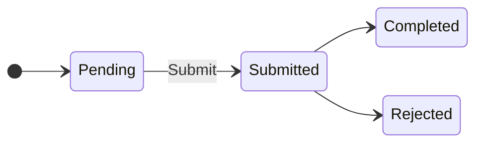
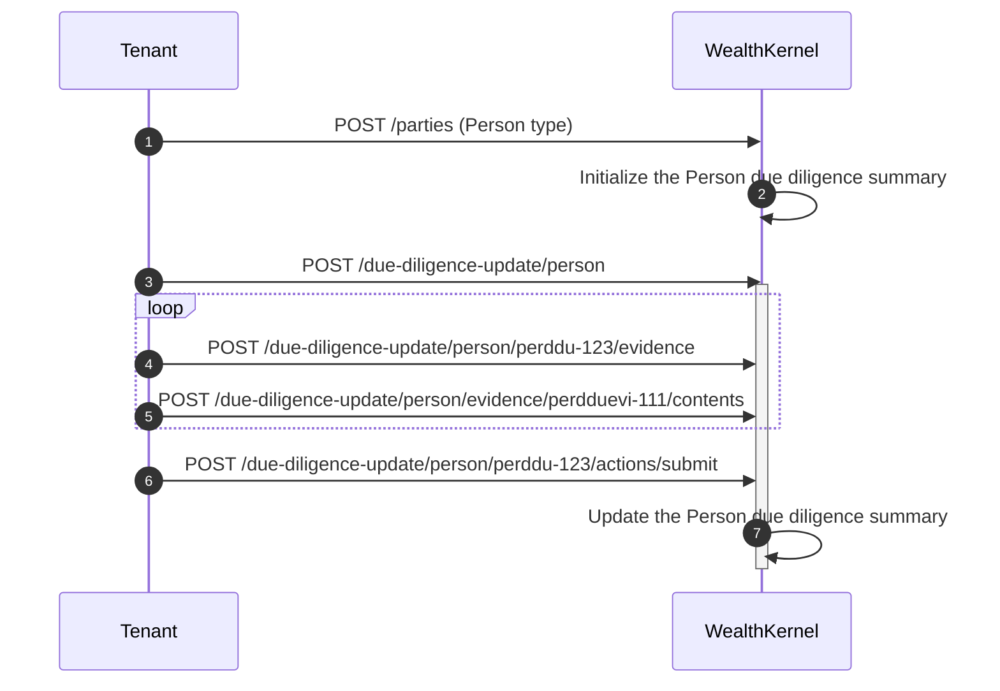

# Due Diligence Outsourcing

We require KYC checks to be performed for each party as part of the onboarding process. Regular checks must also be in place as long as the party has active accounts in the system. Our due diligence outsourcing model is evidence-based, meaning that you can provide evidence for a KYC check along with the outcome from an external KYC provider or your own KYC integration.

Please note that due diligence outsourcing is only available for parties of type `Person`. Organizations are currently not eligible for this model.

### Expectations for tenants using due diligence outsourcing

In order to use due diligence outsourcing, tenants must perform KYC checks for all parties of type `Person` and provide us with the outcome of such checks. Additionally, tenants must have a monitoring system in place, as a person's circumstances could change at any moment.

For persons, the following checks must be undertaken:

- Identity
- Politically exposed persons (PEPs)
- Sanctions
- Material information:
    - Adverse media
    - Legal and regulatory warnings

Note that material information does not have a particular status to update. If you become aware of some material information that should disbar a party from investing, you must contact us.

## Due diligence summary

A due diligence summary contains the most recent state of a person's due diligence. An initial summary with unknown outcomes is automatically initialized after a person is added.

## Due diligence update

Check outcomes and monitoring information can be added to a person's due diligence summary through a due diligence update. Any of the following due diligence fields can be updated:

- Due diligence level
- Identity
- Political exposure
- Sanctions
- Material information

The due diligence update doesn't need all of this information at once. Partial updates are also supported. In the due diligence update request, any undefined field within the five fields mentioned above will be ignored. For example, the following update request is valid:

```json
{
  "partyId": "pty-123",
  "updatedBy": "employee@company.com",
  "politicalExposure": {
    "continuousCheckStartedOn": "2025-04-08",
    "continuousCheckStatus": "Active"
  }
}
```

This request will only update the political exposure's continuous monitoring information, without altering the political exposure status, or any other check information.

A `null` value, in a nullable field, will be honored and recorded in the due diligence summary, for example:

```json
{
  "partyId": "pty-123",
  "updatedBy": "employee@company.com",
  "politicalExposure": {
    "continuousCheckStartedOn": null,
    "continuousCheckStatus": "Inactive"
  }
}
```

This request will also update the political exposure's continuous monitoring information and will not alter the political exposure status, or any other check information.

The `UpdatedBy` field keeps a record of the person who made the update. This is typically the the individual's email address, but `System` is an acceptable value to indicate that the update had no human involvement.

### Monitoring

Tenants can indicate whether a check has monitoring in place by populating the continuous check fields, where available.

### Evidence

To add evidence, you first need to provide the evidence definition. The `Source` and `Reference` fields point to the external KYC system that provides the evidence, if one is used. Note that only PDF files are supported.

Once the evidence definition is in place, you must upload the corresponding content; otherwise, the due diligence update cannot be submitted.

### Lifecycle

The due diligence update has the following lifecycle:



When a due diligence update is created, it stays as `Pending`. Note that it is only possible to add evidence to a due diligence update in this state. After submitting the update, it will be automatically completed. However, the update could be rejected under certain circumstances, for example, when the provided `PartyId` does not exist.

The diagram below shows a typical workflow of a due diligence update.



Steps 3 to 6 show the requests needed to add a due diligence update, from initializing the due diligence update to submitting it.

Steps 4 and 5 can be repeated as many times as needed, as it is allowed to include multiple evidence items in an update, including none.

Finally, when the due diligence update completes in Step 6, the due diligence summary will apply the update.

## Due diligence and Accounts

A person must have a valid due diligence summary in order for their accounts to be activated. A valid due diligence summary must have the following information:

- Identity status: Verified
- Sanctions status: Not sanctioned
- Political Exposure status: Not politically exposed, directly politically exposed, or indirectly politically exposed

Please note that an underlying Customer Risk Assessment system is also in place, which will ultimately decide whether the party can be onboarded or not.

Once a person is onboarded, any subsequent due diligence update could suspend their accounts, depending on the outcome, for example, when a new due diligence update has a `Sanctioned` outcome.
