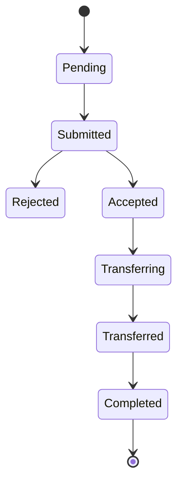

# Basics
## What Is An Inbound Transfer?
This is a transfer of funds from an existing account with another provider into a portfolio managed by WealthKernel.

Currently we only support ISA transfers, however in future we will be supporting others, such as GIA, SIPP and JISA transfers.

The inbound transfer will pass through the following stages:

State | Explanation 
---------|----------
 Pending | The inbound transfer has been requested, it can still be edited and WealthKernel will not process the inbound transfer until you submit it. 
 Submitted | The inbound transfer has been submitted to WealthKernel to be processed and requested from the ceding provider. 
 Accepted | The inbound transfer has been accepted by the ceding provider. 
 Transferring | The funds for the inbound transfer have been sent by the ceding provider to the portfolio managed by WealthKernel. 
 Transferred | The funds for the inbound transfer have been received and are available in the portfolio managed by WealthKernel.
 Completed | The inbound transfer has been compeleted.
 Rejected | The inbound transfer has been rejected by WealthKernel. The reason will be communicated in the status history entry.
 Cancelled | The inbound transfer has been cancelled.

## Status History
For each status change that an inbound transfer goes through, we create a status history entry on the resource with a timestamp and an optional reason (populated for rejections and requests for more information).

## Requesting An Inbound Transfer
To [request an inbound transfer](https://docs.wealthkernel.com/docs/api/c0641cdcaad59-request-an-inbound-transfer) through our API, you must provide us with the details of the account that you would like to transfer (there are specific requirements for each type of transfer, that can be found on the relevant transfer type guide page). We have a list of known ceding providers that can be queried by transfer type. These can be used to speed up the process of collecting data, as we have the address for these providers, so you will not have to collect it from the client. If the ceding provider is not one that is known by us, you can provide the name and address.
Each inbound transfer request must satisfy the following requirements:
- The portfolio referenced on the inbound ISA transfer request must be Active.
- The account that the portfolio is under must be Active.

There are a few things to be aware of when providing client data:

- The client address that we capture should be the address of the client that is registered with the account that they are wanting to transfer.
- The estimated transfer amount does not have to be exact.

Once the resource has been created, it will be in the Pending status and WealthKernel will not process the inbound transfer until you submit it. The reason for this is that you may need to upload a document for the ceding provider. Some ceding providers require a signed form, and so you can choose to provide one at the start of the process or we will ask for one later on if the ceding provider requires one.

> Whilst the inbound transfer is in Pending, you can patch certain details on the resource.

## Attaching A Document To An Inbound Transfer
To attach a document to an inbound transfer, firstly you need to [provide the document metadata](https://docs.wealthkernel.com/docs/api/a19c0afc799f2-add-document-metadata) and after you will be able to [upload your document contents](https://docs.wealthkernel.com/docs/api/ab300f280c6b4-add-document-contents) to the document resource.

Documents can only be attached to a Pending inbound transfer, and you cannot submit the inbound transfer if a document is missing contents.

## Submitting An Inbound Transfer
When all information (including documents) is attached to the inbound transfer, you need to [submit it to WealthKernel](https://docs.wealthkernel.com/docs/api/2d2c732382f2a-submit-inbound-transfer) to be processed.

After submission we validate the inbound transfer to check that the portfolio and account exist, and that the account type is valid for the account that is being transferred. If the information is valid, we will request the transfer from the ceding provider.

If the ceding provider accepts the transfer request, we will move the inbound transfer to the Accepted status.

However, if the inbound transfer fails our validation or the ceding provider rejects our request we move it back to Pending if we need more information or we move it to Rejected if it is not recoverable. You will be able to see the reason in the status history entry.

> If the inbound transfer is moved back to Pending, you can update the resource again.
## After The Inbound Transfer Is Accepted
Once an inbound transfer is Accepted, the ceding provider will begin to liquidate the account (if this is required) and once that is complete, they will send the funds to the portfolio managed by WealthKernel.

Once we receive notification that that has happened, the inbound transfer will move to the Transferring status.

Once we receive the money and it is available in the portfolio, we will move the inbound transfer to Completed.

## Cancelling An Inbound Transfer
You can [cancel an inbound transfer](https://docs.wealthkernel.com/docs/api/197b558519290-cancel-inbound-transfer) that is Pending, Submitted or Accepted. The inbound transfer will be immediately moved to Cancelled if the inbound transfer was Pending. However, if it is not in Pending, it will not immediately move to Cancelled as we may need to request cancellation from the ceding provider, and it may be the case that they have already begun the transfer of the funds and can’t cancel it. 
In the case where we can´t cancel the inbound transfer, we will communicate the reason by adding a new status history entry.