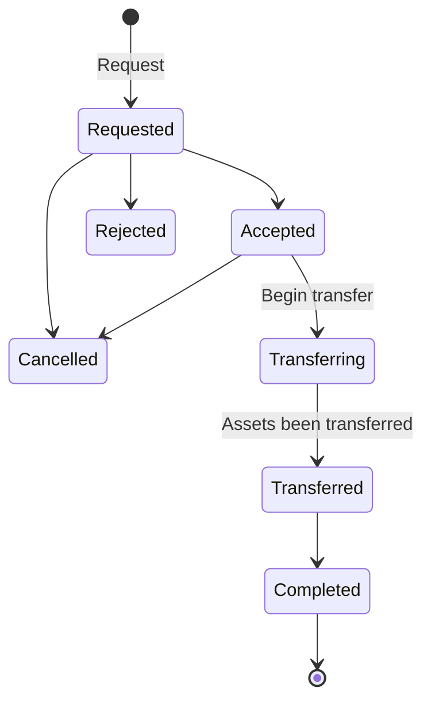

# Outbound transfer basics

<!-- theme: warning -->
> Outbound transfers are currently in beta, and are only available in sandbox.

## What is an outbound transfer?

An outbound transfer is a transfer of an existing account currently managed by WealthKernel (on your behalf) to an external provider. This can be initiated in a couple of ways:

- A customer may request this transfer to you, and then you may need to contact us to begin the outbound transfer
- The external provider may send a transfer form to us on behalf of the customer

An outbound transfer will go through the following flow:

State | Explanation
---------|----------
 Requested | The outbound transfer has been requested. We will run some checks before confirming we can accept the transfer.
 Accepted | The outbound transfer has been accepted, and we will now begin processing the transfer.
 Transferring | We are in the process of transferring the assets to the new provider.
 Transferred | All of the assets have been transferred to the new provider.
 Completed | The outbound transfer has been completed. Confirmation that the transfer has completed will have been sent to the new provider.
 Rejected | The outbound transfer has been rejected by WealthKernel. The reason will be populated on the outbound transfer.
 Cancelled | The outbound transfer has been cancelled.

## On completion of an outbound transfer

Outbound transfers will transfer the entire account out to a new provider, including all portfolios under the account. Once a transfer has been completed, we will automatically close the account and underlying portfolios so that no further cash can be deposited into the account. A new account will need to be added under the party if further assets are expected.

## Availability over API

Currently, you can only retrieve outbound transfers over the API. We do not have endpoints for requesting outbound transfers, and our API is only deployed in sandbox. We aim to deploy this into production in the future when the API is out of beta.

## Webhooks

To enable you to react to outbound transfers being processed, we have webhooks available to you that you can subscribe to. You can find out more about using webhooks on our [webhooks guide](../webhooks/Getting-Started.md), or look at our main API documentation to see the structure of each of the outbound transfer webhooks.

| Event Type                                          | Description |
|-----------------------------------------------------|--------:|
| `outbound_transfers.outbound_transfer_requested`    | Notification that a new outbound transfer has been requested. The inbound transfer will be in the `Requested` status. |
| `outbound_transfers.outbound_transfer_accepted`     | We have completed our checks and accepted the transfer. We will now begin processing the transfer. |
| `outbound_transfers.outbound_transfer_transferring` | Assets are being transferred to the new provider. |
| `outbound_transfers.outbound_transfer_transferred`  | We have transferred all assets over to the new provider. |
| `outbound_transfers.outbound_transfer_completed`    | The transfer has been completed. The new provider will have been notified that all of the assets have been sent. |
| `outbound_transfers.outbound_transfer_rejected`     | We have rejected the outbound transfer. The rejection reason will be populated on the outbound transfer. |
| `outbound_transfers.outbound_transfer_cancelled`    | The outbound transfer has been cancelled. |