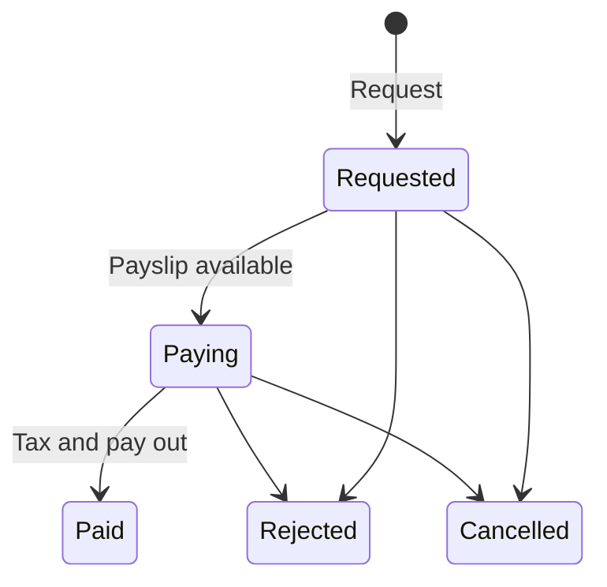

# Basics

## What are pension income payments?

Pension income payments are payments that are paid out from a pension product that is in drawdown. On the WealthKernel platform, these will be from portfolios in a decumulation SIPP type account.

## How are income payments requested?

Pension income payments are currently in a **closed Beta** and cannot be requested using our API. Please contact us to set up pension income payment(s) for a decumulation SIPP type account.

When requesting pension income payments, we will need the following information:
- Portfolio ID: the portfolio the pension income payments should be originate from.
- Bank account ID: the bank account that the pension income will be paid into.
- The breakdown of the pension income, including the gross amount, tax-free amount and taxable amount.

## How do they differ to withdrawals?

Pension accounts do not support withdrawals due to the differences in the workflow. They are paid out in a similar manner to PAYE (pay-as-you-earn) and the person receiving the income will be sent a payroll payslip, as tax is paid as part of the payment process.

Unlike withdrawals, pension income payments can be broken down into different components:
- Gross amount: the total amount being paid out before tax is taken;
- Tax-free amount: the amount being paid out that is tax-free, and will have no tax deducted;
- Taxable amount: the amount being paid out that has tax due, and will therefore have tax deducted before payment;
- Tax: the amount of tax being taken from the taxable amount.

The net amount received by the party can be calculated by taking the gross amount and subtracting the tax. Note that fees are not taken as part of this payment process and should be taken separately.

Pensions have a limit on how much tax-free cash can be taken. It is important that the above breakdown of the pension income payment is displayed to the person so that they can understand the amounts being taken.

## Pension income payments workflow

### Pre-requisites

Before any pension income can be paid out, the following steps must already be completed:
- There must already be a decumulation-type (drawdown pension) SIPP account open for the party;
- There must already be a portfolio in the decumulation SIPP account for the money to be taken from;
- The assets must already have transitioned from the accumulation SIPP account to the decumulation SIPP account by instruction of a BCE (benefit crystallization event). Crystallizations are not available using our API, but can be requested by contacting us.

Note that if there is insufficient cash for a pension income payment in the portfolio, assets will be sold to raise cash before the pension income payment is requested in our system.

### Lifecycle

Pension income payments go through the following lifecycle:

1. First, the pension income payment is requested and will be in the status `Requested`. At this point, the request has not been actioned.
2. Once the payslip is available, the payment will progress to `Paying`. This means we are preparing to pay out the income to the party.
3. Before paying out the income payment, we need to take the tax from the portfolio. This will appear as an `InternalCashTransferOut` transaction on the portfolio.
4. Once tax has been taken, we will then proceed to pay the net income to the party. This will appear as a `Withdrawal` transaction on the portfolio.
5. After the tax has been taken and the net amount is paid, the pension income payment will be in the status `Paid` and at the end of the lifecycle.

We may reject payments when something doesn't look right, such as if there isn't sufficient cash for the pension income payment. Pension income payments can also be cancelled on request.