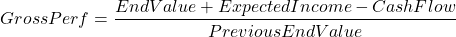

# Performance basics

There are many different methods to calculate performance. We offer an API for one such method, Time Weight Rate of Return (TWRR), as the effect of cash flow can be filtered out. We calculate two figures using this methodology, one gross figure and one net of fees. 

Performance intervals are daily, except for weekends where Saturday to Monday is treated as a single interval.

<!-- theme: warning -->
> If WealthKernel does not know how your fees are accrued, these figures will not be accurate.

# How does our performance calculation work?

For a given day we calculate the rate of return as 

<!--TODO: Could make this mermaid diagram when stoplight supports mermaid v10.9.0 https://mermaid.js.org/config/math.html -->

or

In other words, we take the value at the end of the current interval, add on expected income, subtract cashflow, (and accrued fees for the net figure) and divide by the end value at the end of the previous interval.

<!-- theme: info -->
> ExpectedIncome here represents dividends which have been declared but not yet paid. This helps smooth out spikes which can be seen in the examples.

# Examples

Assume a £100 deposit, a £2 increase in value after holding the assets for a day, and £1 on days after. For illustrative purposes settlement is assumed to be T+1.

## Simple

In the most simple example, there are no fees, dividends or cash flow. For a value of £100, measuring the TWRR for an increase in value to £102 the next day gives a value of 0.02 or 2%.

|Day|StartValue|EndValue|Performance Gross|Performance Net|
|--------|--------|--------|--------|--------|
|Day n|£0|£100|-|-|
|Day n+1|£100|£100|((100+0-0)/100)-1=0 or 0%|((100+0-0)/100)-1=0 or 0%|
|Day n+2|£100|£102|((102+0-0)/100)-1=0.02 or 2%|((102+0-0-0)/100)-1=0.02 or 2%|

There are no performance figures on day n, as this is only a single interval, so the first available point performance can be calculated is day n+1.

## Fees

In a more complex example, there could be more components affecting the TWRR. Given a calendar day fee strategy of 10% for a value of £100, a single day's fees would come to ~£0.03.

|Day|StartValue|EndValue|Accrued Fees|Performance Gross|Performance Net|
|--------|--------|--------|--------|--------|--------|
|Day n|£0|£100|£0.00|-|-|
|Day n+1|£100|£100|£0.02737|((100+0-0)/100)-1=0.02 or 2%|((100+0-0-0.02737)/100)-1=-0.0002737 or -0.02737%|
|Day n+2|£102|£102 holdings|£0.02792|((102+0-0)/100)-1=0.02 or 2%|((102+0-0-0.02737)/100)-1=0.0197 or 1.97%|

We only include accrued fees in the net figures, so the gross figure is the same as before. The net figure is slightly less, reflecting the fees accrued.

## Dividends and ExpectedIncome

Due to the nature of the TWRR, dividends are included ahead of time to negate odd figures being produced under certain circumstances, which can also affect aggregated performance. If we were to include dividends in performance on the day they are paid, it would look like this:

|Day|StartValue|EndValue|Dividend|Cash flow|Performance Gross
|--------|--------|--------|--------|--------|--------|
|Day n|£0|£100|-|-|-|
|Day n+1|£100|£100|-|-|((100+0-0)/100)-1=0 or 0%|
|Day n+2|£100|£102|-|-|((102-0)/100)-1=0.02 or 2%|
|Day n+3|£102|£3|-|-100|((3-(-100))/102)-1=0.009803 or 0.9803%|
|Day n+4|£3|£14|-|10|(14/3)-1=3.666666 or 366.6666%|

If a dividend is paid on day n+4, after a withdrawal of £100 has taken place on day n+3, the performance for that day becomes 3.6666 or 366.66%. This is not a good representation of the performance of the investor's portfolio. This effect will also mean any aggregation of performance suffers from the same problem. For example aggregating the figures across the last 3 days would produce a figure of 3.8066 or 380.66%.

To counteract this, we instead include the dividend on the record date, and call it `ExpectedIncome`. This is an approximation and may vary slightly compared to the actual payment.

|Day|StartValue|EndValue|ExpectedIncome|Cash flow|Performance Gross
|--------|--------|--------|--------|--------|--------|
|Day n|£0|£100|-|-|-|
|Day n+1|£100|£100|-|-|((100+0-0)/100)-1=0 or 0%|
|Day n+2|£100|£102|10|-|((102+10-0)/100)-1=0.12 or 12%|
|Day n+3|£102|£3|-|-100|(3+0-(-100))/102=0.009803921569 or 0.9803%|
|Day n+4|£3|£14|-|10|((14+0-10)/3)-1=0.333333 or 33.3333%|

The figures now show a 12% increase from £100 to £112 on day n+2, and an increase in the value of the holdings on day n+4 more accurately (a 33.3333% increase from £3 to £4). We treat the dividend as cash flow on day n+4 as it has already been accounted for as `ExpectedIncome` on day n+2.