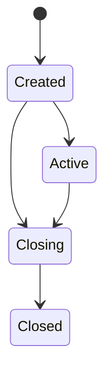

# Portfolio basics

Portfolios are a container for an investor's cash and holdings. All investment activity on the WealthKernel platform (balances, orders, transactions) is directly tied to a portfolio.

## Mandate types

### Execution only mandate

Trades will only be requested when instructed to do so through the orders API.

### Execution only model mandate

Only deposits and withdrawals will be invested/disinvested according to the configured model. The portfolio will not be periodically rebalanced to compensate for drift.

### Discretionary mandate

Deposits and withdrawals will be invested/disinvested according to the configured model. The portfolio will be periodically rebalanced to compensate for drift.

### Null mandate

No trades will be executed.

### Changing a mandate's model

The model of a execution only model or discretionary mandate can by changed using our [portfolios API](https://wealthkernel.stoplight.io/docs/api/bf12b86730c62-change-a-portfolio-s-mandate-or-model).

## Portfolio lifecycle

Once a portfolio has been added, it has a lifecycle starting from `Created` (meaning the portfolio can't be funded yet) to `Closed` (meaning the account has been fully withdrawn and will no longer be funded).

We recommend a portfolio is closed once fully withdrawn and a new portfolio opened should the investor wish to continue investing.

| Status | Explanation |
|---|---|
| Created | A short-lived state where the portfolio isn't ready for funding. |
| Active | All checks have passed and the portfolio is available to be used. |
| Closing | Portfolio is in the process of closing but is not closed yet. This may be because there are still holdings currently in the process of selling down. |
| Closed | Portfolio is closed. This is the terminal state for a portfolio. |
