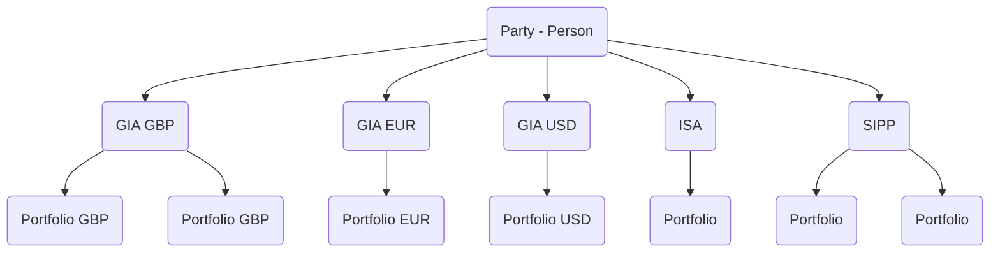
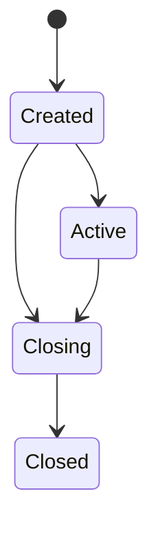

# Portfolio basics

Portfolios are a container for an investor's cash and holdings. All investment activity on the WealthKernel platform (balances, orders, transactions) is directly tied to a portfolio. When a portfolio is created under an account, it will inherit the same currency as the account. Multiple portfolios can be created under a single account to allow for different investment strategies. However, we do not recommend mixing and matching mandate types.

The below diagram represents an example account and portfolio structure. 

## Portfolio characteristics

The following table provides a summary of how currencies work across different functions. 

| Function | GBP Portfolio | EUR Portfolio | USD Portfolio | Notes |
|---|---|---|---|-------------|
| Money in | GBP, EUR, USD | GBP, EUR, USD | GBP, EUR, USD |All currencies can be paid into any portfolio under a GIA account. Portfolios under ISA and SIPP accounts only support GBP being paid in|
| Money out | GBP, EUR, USD | GBP, EUR, USD | GBP, EUR, USD |All currencies can be paid out of any portfolio under a GIA account. Portfolios under ISA and SIPP accounts only support GBP being paid out|
| Valuations | GBP | EUR | USD |The valuation of a portfolio will be in the currency of the account that the portfolio is under|
| Balances | GBP | EUR | USD |The balance of a portfolio will be in the currency of the account that the portfolio is under|
| Dividends | GBP | EUR | USD |Dividends will be paid into a portfolio in the currency of the portfolio|
| Settlement| GBP, EUR, USD | GBP, EUR, USD | GBP, EUR, USD |Multicurrency trading means that you can specify any settlement currency.  order.SettlementCurrency is a required field and will shortly be respected by the orders service|
| Fees | GBP | Not supported  |Not supported |Fees can only be taken in GBP from GBP portfolios|
| Charges | GBP, EUR, USD | GBP, EUR, USD | GBP, EUR, USD |Charges can be added in any currency and paid out in that same currency|
| Currencies that can be held | GBP, EUR, USD | GBP, EUR, USD | GBP, EUR, USD |All currencies can be held in any portfolio under a GIA account. Portfolios under ISA and SIPP accounts only hold GBP|

## Mandate types

### Execution only mandate

Trades will only be requested when instructed to do so through the orders API.

### Execution only model mandate

Deposits and withdrawals will be invested/disinvested according to the configured model. The portfolio will not be periodically rebalanced to compensate for drift; however, we can establish a rebalance schedule if necessary.

### Discretionary mandate

Deposits and withdrawals will be invested/disinvested according to the configured model. The portfolio will be periodically rebalanced to compensate for drift.

### Null mandate

No trades will be executed.

## Changing a mandate's model

The model of an execution only model or discretionary mandate can by changed using our [portfolios API](https://wealthkernel.stoplight.io/docs/api/bf12b86730c62-change-a-portfolio-s-mandate-or-model).

## Portfolio lifecycle

Once a portfolio has been added, it has a lifecycle starting from `Created` (meaning the portfolio can't be funded yet) to `Closed` (meaning the account has been fully withdrawn and will no longer be funded).

We recommend a portfolio is closed once fully withdrawn and a new portfolio opened should the investor wish to continue investing.

| Status | Explanation |
|---|---|
| Created | A short-lived state where the portfolio isn't ready for funding. |
| Active | All checks have passed and the portfolio is available to be used. |
| Closing | Portfolio is in the process of closing but is not closed yet. This may be because there are still holdings currently in the process of selling down. |
| Closed | Portfolio is closed. This is the terminal state for a portfolio. |
