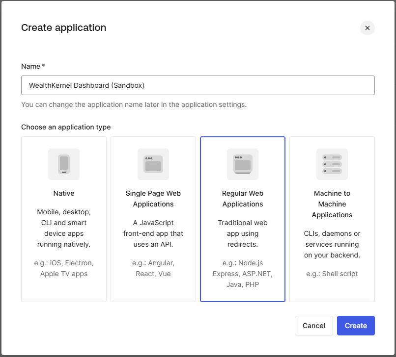
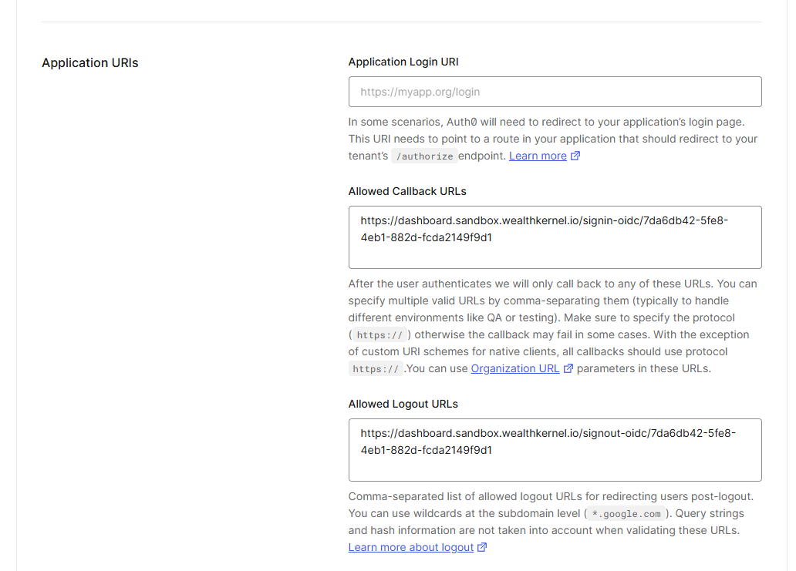
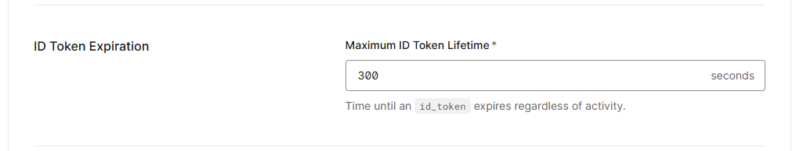

# SSO with Auth0

This document describes the steps to set up Auth0 application for Single Sign-On (SSO) access to WealthKernel Dashboard.

# Steps

1. In Auth0, go to the **Applications** section and click **Create Application**. Name the application `WealthKernel Dashboard (Sandbox)` or `WealthKernel Dashboard (Production)` depending on the environment, and choose **Regular Web Applications** application type.
    <!-- focus: false --->
    

2. From the new application's settings section, note down the `Domain`, `Client ID` and `Client Secret` values.

3. Configure `Allowed Callback URLs` and `Allowed Logout URLs` with values provided by WealthKernel support.
    <!-- focus: false --->
    

4. Configure `Maximumum ID Token Lifetime` to be a shorter, for example, `300 seconds`.
    <!-- focus: false --->
    

5. Provide the following details back to WealthKernel support:

- Type of your SSO provider (Auth0)
- `Domain`
- `Client Id`
- `Client Secret`

6. Once the SSO provider is set up by WealthKernel, users will start being redirected to the Auth0 login page when trying to access the Dashboard.
