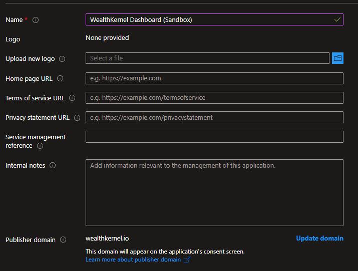
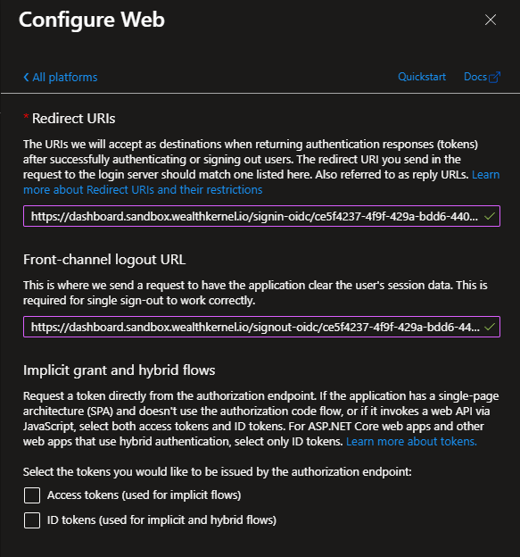

# SSO with Microsoft Entra ID

This document describes the steps to set up Entra ID application for Single Sign-On (SSO) access to WealthKernel Dashboard.

# Steps

1. Login to Azure Portal or Microsoft Entra Admin Center, and go to **App Registrations**.

2. Click on the **New Registration** and set the name to `WealthKernel Dashboard (Sandbox)` or `WealthKernel Dashboard (Production)` depending on the environment. If required, change the **Supported account types**. Click **Register** to continue.

3. In the App Registration's **Overview** section, note down your application registration's `Client Id`.

4. In the App Registration's **Branding & properties** section, make a note of the **Publisher domain** value.

   

5. In the App Registration's **Authentication** section, click **Add a platform**, choose **Web** and configure redirect URIs with values provided by WealthKernel support. When done, click **Configure**.

   

6. In the App Registration's **Certificates & Secrets** section, click **New client secret** to generate a secret. Note it down as you will need it in the later step.

7. Provide the following details back to WealthKernel support:

   - Name of your SSO provider (EntraID)
   - Authority URL: `https://login.microsoftonline.com/<PUBLISHER_DOMAIN>` (from step 4)
   - `Client Id`
   - `Client Secret`

6. Once the SSO provider is set up by WealthKernel, users will start being redirected to the Microsoft Entra ID login page when trying to access the Dashboard.
