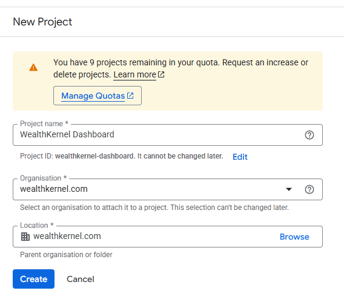
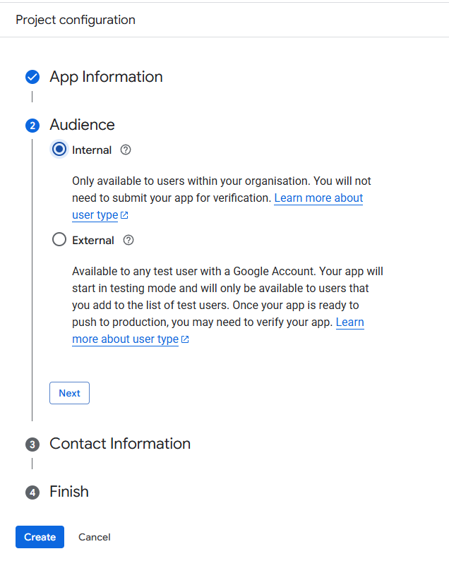
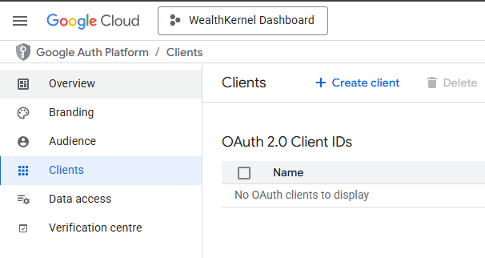
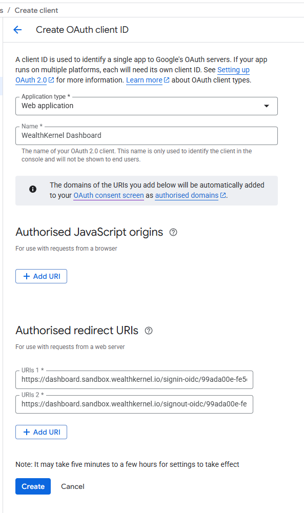

# SSO with Google

This document describes the steps to set up Google OAuth application for Single Sign-On (SSO) access to WealthKernel Dashboard.

# Steps

1. Navigate to https://console.developers.google.com and click **Create Project**. On the **New Project dialog**, set the name of the project and choose your organisation and location.

    

2. From the APIs & Services menu, select OAuth consent screen and click on **Get Started** button.
3. Set the app name, and audience to **Internal**

    

4. Once configured, go to the **Clients** section and click **Create client**

    

5. Configure the new OAuth client ID

    Application type: **Web application**

    Authorised redirect URIs: (values supplied by WealthKernel)

    

6. Provide the following details back to WealthKernel support:

    - **Name of your SSO provider (Google)**
    - **Authority URL: https://accounts.google.com**
    - **Client Id**
    - **Client Secret**

7. Once the SSO provider is set up by WealthKernel, users will start being redirected to the Microsoft Entra ID login page when trying to access the Dashboard.
