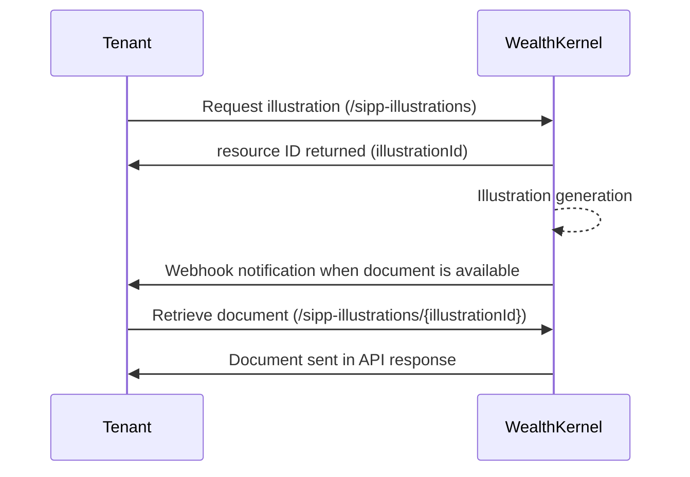

# Basics

## What is an illustration?

An illustration is a document which models a product over time. They are predominantly used for pension products, which must be produced according to regulation. 

An accumulation illustration models the growth of a product based on contributions or transfers added to the product, expected investment growth and the impact of fees. Growth rates are governed by legislation, whilst fees should represent those which are applicable to the customer. Figures are an estimation based on the details provided and the value of the product could be more or less than what has been projected.

Drawdown illustrations are similar to accumulation illustrations, but these cover at-retirement options where funds can be taken from a pension. Investment growth and fees work in the same way compared to an accumulation illustration, however income (instead of contributions) may be modelled in the illustration. 

The illustration allows one product and/or provider to be compared to another, assuming the investment selection and contribution information is consistent between the two. Where investment growth and contributions are consistent, the impact of fees between product providers can be easily compared.

## Current supported scope

At present, the illustration service only supports accumulation SIPPs. Support for benefit crystallisations and drawdown transfers will be available in future releases. 

The illustrations service supports the following capabilities for accumulation:
- Member information
- Member contributions
  - Single or multiple
  - Start/end date
  - Frequency
- Transfers
  - Single or multiple
- Fees
  - Adviser
  - Provider
  - DFM
- Investment selection
  - Model
  - Individual assets
  - Investment fees (initial and OCF)

## How to produce an illustration

The below diagram represents the process flow for generating an illustration.

Presently, only the document can be retrieved, rather than the underlying data which is used to populate the document. 