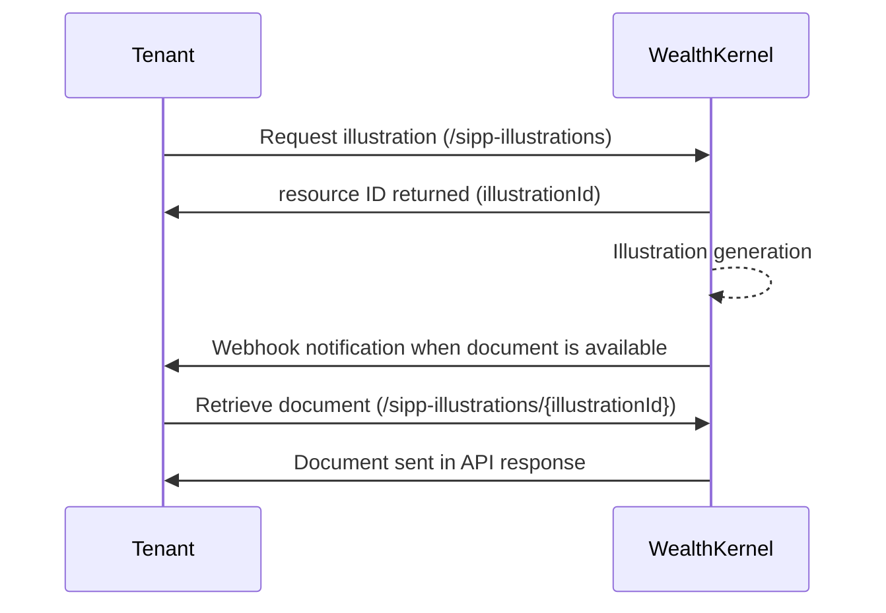

# Sandbox simulation

The purpose of simulating illustrations in Sandbox is to:

1. Understand the different combinations of inputs available within an illustration (e.g. contributions, transfer, fees and charges)
2. Ensure requests are valid for individual fields and combinations of fields
3. Build against the workflow of submitting an illustration request and retrieving the illustration document

## Simulation an illustration request and document retrieval

The following workflow matches that of the production service. In the Sandbox environment however, the document generated is a stubbed document with example data only, not an illustration based on the inputs of the API request. 

