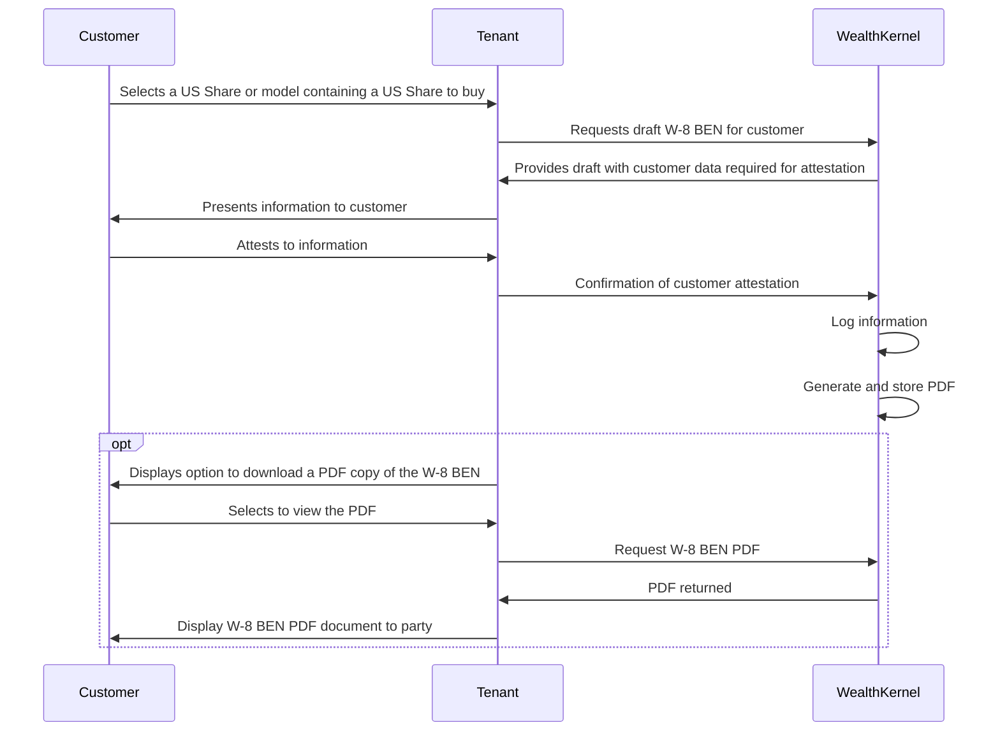

# US Withholding Tax

When a non-US resident invests in US shares, the US government mandates information is provided to confirm the non-US residential status, usually by way of completing a W-8 BEN form.  

The W-8 BEN form is a declaration by the customer and includes information such as their personal details and tax residency. The form remains active until the end of the third calendar year after the form is signed (i.e. if the form is signed in January 2024, it is valid until 31st December 2027).

WealthKernel provides a service for Tenants which will generate all of the required information to complete the W-8 BEN form to be presented to a customer. If all of the information presented to a customer is correct, the customer can attest to the information. Tenants can submit a customer's attestation which will create a PDF copy of the W-8 BEN form with a digital signature of the customer. The customer can access a copy of the W-8 BEN form should they require for their records. 

In all cases, a customer must complete a W-8 BEN form to hold shares in a GIA and ISA. 

The below process shows the sequence in which the API should be called. 

When displaying the information to the customer, the wording must include the following attestation:

Under penalties of perjury, I declare that I have examined the information on this form and to the best of my knowledge and belief it is true, correct, and complete. I further certify under penalties of perjury that:

* I am the individual that is the beneficial owner (or am authorised to sign for the individual that is the beneficial owner) of all the income or proceeds to which this form relates or am using this form to document myself for chapter 4 purposes;
* The person named on line 1 of this form is not a U.S. person;
* This form relates to:
1. income not effectively connected with the conduct of a trade or business in the United States;
2. income effectively connected with the conduct of a trade or business in the United States but is not subject to tax under an applicable income tax treaty;
3. the partner’s share of a partnership’s effectively connected taxable income; or
4. the partner’s amount realised from the transfer of a partnership interest subject to withholding under section 1446(f);
* The person named on line 1 of this form is a resident of the treaty country listed on line 9 of the form (if any) within the meaning of the income tax treaty between the United States and that country; and
* For broker transactions or barter exchanges, the beneficial owner is an exempt foreign person as defined in the instructions.
* I agree to the electronic submission of tax information under an electronic signature

Furthermore, I authorise this form to be provided to any withholding agent that has control, receipt, or custody of the income of which I am the beneficial owner or any withholding agent that can disburse or make payments of the income of which I am the beneficial owner. I agree that I will submit a new form within 30 days if any certification made on this form becomes incorrect.
