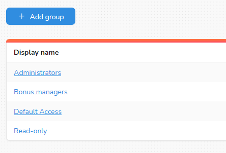

# Groups

The groups page can be found under the 'Configuration' area of the nav menu.

Groups are used to control which permissions your users have.  By default, a newly created user does not belong to 
any groups.  To allow them to perform various tasks in the dashboard, assign them to an existing group, or create a 
new group with custom permissions.

## Group members

Use the 'members' tab on the group page to add or remove users from a group

## Group permissions

Use the 'permissions' tab on on the group page to edit which permissions are assigned to that group

<!-- theme: info -->
> Note: Changes to group membership and permissions only take effect the next time the user logs in.
