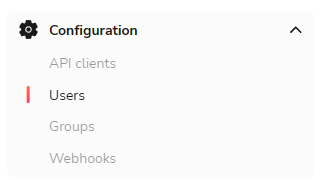
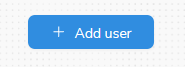
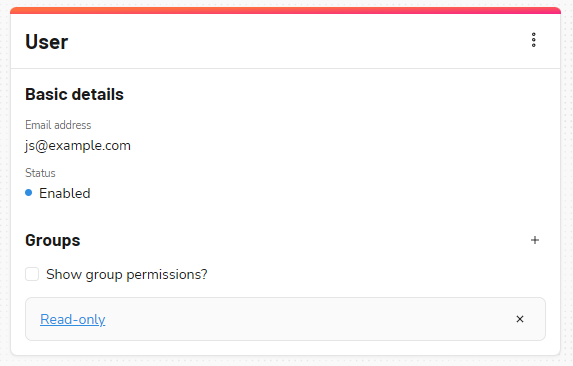
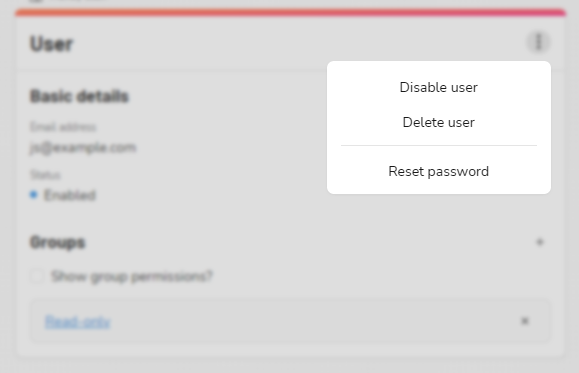

---
tags: [User Management]
---

# Users

The users page can be found under the 'Configuration' area of the nav menu.

To invite a new user to the dashboard, click the 'Add user' button at the top of the Users page

Fill in the user's name and email address.  They will receive an email inviting them to log in.

## User settings

The user page shows you their status and which groups they currently belong to.  (See the [Groups](./Groups.md) 
page for more details on group and permission configuration)

The '...' menu in the top right allows you to perform various actions for a user.  (Note: the 'reset password' 
option will be hidden if your organization uses single-sign-on (SSO))

Disabling a user will keep their settings, but prevent them from logging in.  Deleting a user will remove them from the 
dashboard entirely.