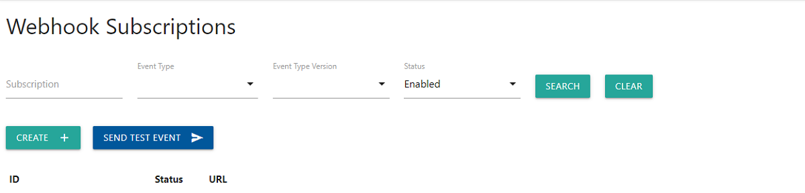

# Getting Started

## Tunnelling traffic to your local machine

To test out webhooks locally without deploying an application to an environment or exposing your test environments to the Internet, you can use ngrok, a free service which tunnels internet traffic to your local environment. 

Download ngrok [here](https://ngrok.com/download), then follow their getting started guide.

## Configuring webhooks through the portal

Once you’re up and running with ngrok, you’ll need to configure our webhooks as follows:

1. Generate a secret in the portal and save its value for later

  

2. Create subscription in the portal, using the HTTPS URL provided by ngrok, e.g. `https://9999-123-456-789-12.ngrok.io`

  
  

Ensure ngrok is running and forwarding traffic to the port on which your local application is running.

You can then send the test event by clicking the button in admin portal or sending an API request
The request will be sent to your local application via ngrok, where you can:

### 1. Handle the event

Receive the POST request on your HTTPS endpoint

### 2. Check the signature

On every webhook request there is a header called `X-Webhook-Signature`. It is composed of a timestamp and upto two HMACs

First you'll need to split the header down into its component pieces using comma (`,`) as a delimiter. The timestamp can be identified by the `t=` prefix. The HMACs can be identified by a scheme prefix, e.g. `v1=`. Note that if you have generate multiple secrets you might need to compare against more than one HMAC.

Next you'll need to take the body of the webhook request and concatenate the value of the timestamp element to the end.
Compute the HMAC with SHA-256 as the hash function, using your secret as the key, and the output from the previous step as the message. Encode the genereated HMAC in base64.

Lastly, compare the base64 encoded HMAC(s) in the X-Webhook-Signature header with the base64 encoded HMAC(s) you have generated.

<!-- theme: info -->
> A constant time string comparison here is recommended

### 3. Return a successful HTTP status code, e.g. 200

You may wish to return another status code, e.g. 401, if the signature check failed or the timestamp comparison falls outside of your tolerance.

### 4. Perform any business logic based on the new information you have received

The rest is up to you!
