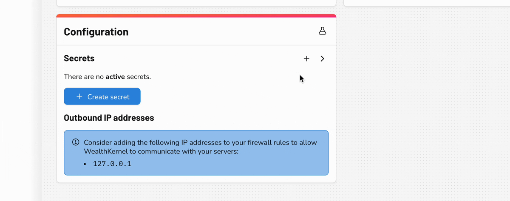
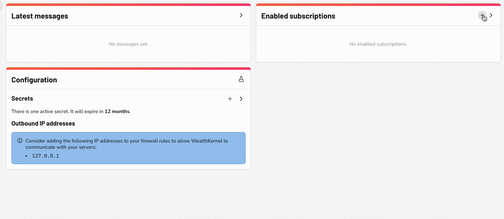

# Getting started

## Tunnelling traffic to your local environment

To test out webhooks locally without deploying an application to an environment or exposing your test environments to the Internet, you'll need some additional tooling. There are third party services to help you tunnel internet traffic to your local environment. In this guide we will be using ngrok.

Download ngrok [here](https://ngrok.com/download), then follow their getting started guide.

## Configuring webhooks through the dashboard

Once you’re up and running with ngrok you will need to configure your webhooks through our dashboard, using the left menu to navigate to the webhook pages

1. Navigate to the webhooks configuration section and click on the '+' button next to the 'Secrets' heading. Select your desired secret lifetime and then click on 'Create secret', ensure you save its value for later. Note that you may only have two active secrets.

  

2. Navigate to the webhook subscriptions section and click on the `+` button. Enter the HTTPS URL provided by ngrok, ensuring you specify the path that your application has been set up on e.g. `https://9999-123-456-789-12.ngrok.io/webhooks`. Select the event type 'Test event (v1)', then click on 'Add subscription'.

  

Ensure ngrok is running and forwarding traffic to the port on which your local application is running.

You can then send the test event by clicking the button in the dashboard or sending an API request.

## Receiving the webhook request

After the above configuration is complete, you're set up to receive the request. In your application you'll need to:

### 1. Handle the event

Receive the POST request on your HTTPS endpoint.

### 2. Check the signature

Verify that the webhook request came from WealthKernel. More detail on how to do this can be found [here](./Secrets.md).

### 3. Return a successful HTTP status code, e.g. 200

You may wish to return another status code, e.g. 401, if the signature check failed or the timestamp comparison falls outside of your tolerance.

### 4. Perform any business logic based on the new information you have received

We recommend that you perform any actions only once you have responded to the webhook, as you'll need to respond promptly to ensure the webhook request does not time out. The rest is up to you!
