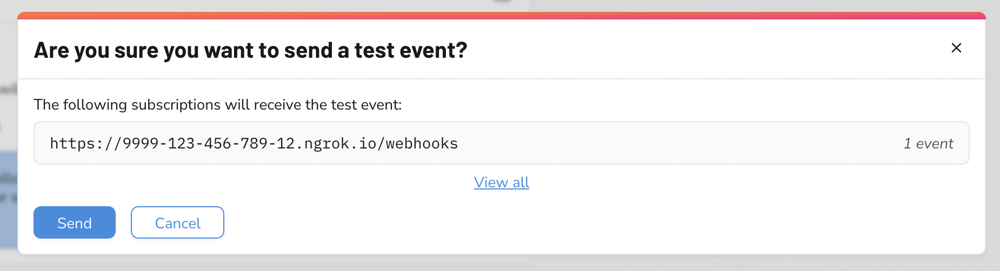
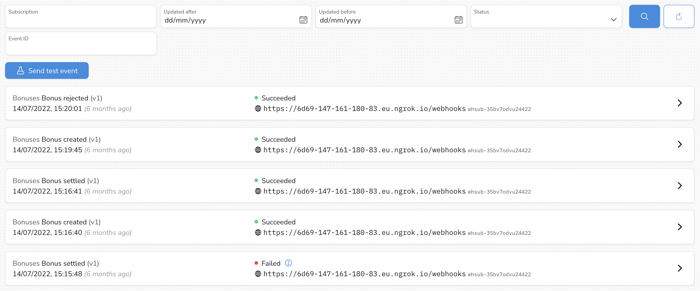
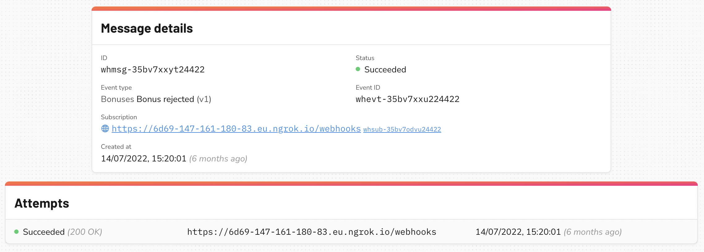

# Testing

To enable you to check you have set up your infrastructure correctly, we offer a test event type. This can be triggered via API or in our dashboard webhooks configuration page.

  

It does not contain any information pertaining to a resource, just the following:

```json
{
  “eventId”: ”whevt-abc123”,
  “eventType”: {
      “name”: “webhooks.test”,
      “version”: 1,
  },
  “payload”: {
      
  }
}
```

Note that if this is triggered from our dashboard, the payload will be:

```json
“payload”: {
  "event": "This event was sent from WealthKernel Dashboard."
}
```


You can view the status of webhook requests in our dashboard.

  

The details of an individual request can be seen from the details page, including the HTTP status code we received. You can also manually resend from this page should the automatic retries have been exhausted.

  

Webhooks are also available to try out on our sandbox environment. 

If you want to receive webhooks locally, you can use a service such as ngrok to make your local endpoint accessible publicly, see [here](../webhooks/Receiving-Webhooks.md) for more information. 

You may wish to disable the webhook subscription for this event when you are finished.
