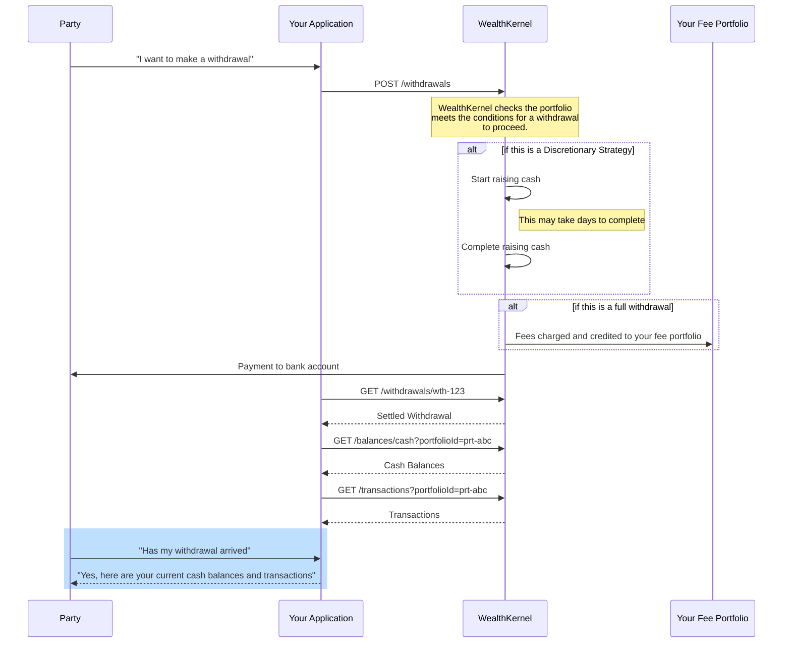

# Requesting a Withdrawal from a Portfolio

The process of withdrawing from a portfolio involves multiple steps:

1. Construct a Withdrawal Definition.
    - `type` is the type of withdrawal, `SpecifiedAmount` or `Full`.
    - `portfolioId` is the identifier of the portfolio to withdraw from.
    - `bankAccountId` is the identifier of the bank account the withdrawal will be going to. If `null` or not set, the party's default bank account will be used.
    - `consideration` is the amount requested in the withdrawal.
    - `reference` is the expected reference that will accompany the withdrawal. Please see the [FAQs](docs/withdrawals/FAQs.md) for guidance on values to use.
2. `POST` the definition to `/withdrawals`.
3. WealthKernel perform the appropriate checks and then pay out the amount requested.
5. Once completed, the withdrawal will move to a status of `Settled`, a transaction will be booked against the source portfolio which will be reflected in the balance.

